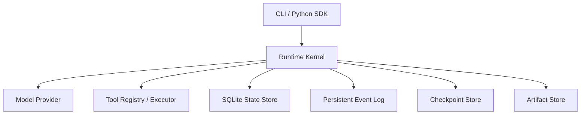
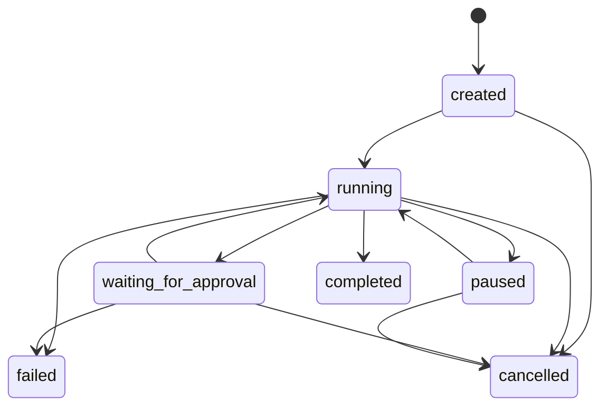

# Agent Runtime 当前架构

> 最近更新：2026-08-13
> 关联记录：[E2026-08-13-001](./CHANGELOG.md#e2026-08-13-001)
> 关联决策：[ADR-0005](./adr/0005-tool-execution-idempotency.md)、[ADR-0001](./adr/0001-runtime-kernel.md)、[ADR-0002](./adr/0002-model-provider-protocol.md)、[ADR-0003](./adr/0003-sqlite-event-checkpoint.md)、[ADR-0004](./adr/0004-tool-security-boundary.md)

## 1. 系统目标和边界

当前系统是一个面向开发者的、可持久化的单 Agent Runtime。它负责将用户输入转化为受控的模型与工具执行循环，并保留运行状态、事件和 Checkpoint。

当前架构优先保证：接口可替换、执行有界、状态可观察、失败可收敛、人工可介入。它不是分布式调度平台，也不是不可信代码沙箱。

## 2. 总体架构



核心依赖方向由入口指向 Runtime，再由 Runtime 依赖抽象化的 Provider、Tool 和 Store；模型厂商响应和具体工具实现不进入 Runtime Kernel 的领域模型。

## 3. Runtime Kernel

`Runtime` 负责：

- 注册 `AgentDefinition`。
- 创建、启动、等待和恢复 `AgentRun`。
- 执行有最大步数和最大工具调用数的 Agent 循环。
- 将模型响应规范化为文本或 `ToolCall`。
- 触发工具执行、人工审批和 Checkpoint。
- 将完成、失败、暂停和取消收敛为明确 Run 状态。
- 将关键动作写入持久化 Event Log。

公开入口包括 `run()`、`start()`、`wait()`、`stream()`、`pause()`、`resume()`、`cancel()` 和 `resolve_approval()`。

## 4. Run 状态机



非法状态迁移由领域模型拒绝。`completed`、`failed` 和 `cancelled` 是终态。

## 5. Model Provider 层

`ModelProvider` 协议接收统一的 `Message`、`ToolDefinition` 和 `ModelConfig`，返回 `ModelResponse`。Runtime 只理解：

- 文本内容。
- 结构化工具调用。
- finish reason。
- token usage。

当前实现：

- `MockProvider`：确定性测试和本地 Demo。
- `OpenAICompatibleProvider`：通过标准库 HTTP 客户端调用 Chat Completions 兼容端点。

Provider 调用由 Runtime 统一处理超时和指数退避重试。当前尚未实现模型 token 原生流式协议。

## 6. Tool Executor

工具由 `ToolDefinition`、handler 和超时组成，通过 `ToolRegistry` 注册。执行前进行基础 JSON-schema 风格校验，执行结果统一转换为 `ToolResult`。

当前支持：

- 同步和异步 Python handler。
- required、type、enum 和 additionalProperties 校验。
- 单工具超时。
- 工具异常标准化并回传给模型。
- `requires_approval` 人工审批标记。
- `side_effecting` 副作用标记。
- `CancellationToken` 协作式取消和稳定的 `idempotency_key`。

## 7. SQLite、Step、ToolExecution、Checkpoint 和 Artifact Store

`SQLiteStore` 当前保存：

```text
schema_migrations
runs
events
checkpoints
approvals
steps
tool_executions
```

数据库启用 WAL 和 foreign keys，并通过编号 migration 初始化和升级 schema。`Step` 表示一次模型决策，`ToolExecution` 表示该决策内有序的工具调用。

ToolExecution 保存参数、状态、结果、错误、审批关系、side-effect 标记和 idempotency key。工具完成状态、Run 计数、Checkpoint 和对应 Event 可以在同一 SQLite 事务中提交，降低半状态风险。

Checkpoint 保存恢复所需的消息历史、模型步骤和工具调用计数。`ArtifactStore` 将大文本产物写入按 Run 隔离的目录，但通用大结果自动转存尚未接入执行循环。

## 8. Event Log

每个 Run 的事件使用从 1 开始的单调递增 `sequence`。当前事件覆盖：

```text
run.created / started / recovered / paused / completed / failed / cancelled
model.requested / completed / delta
tool.requested / started / completed / failed / rejected / cancelled / outcome_unknown / unknown_resolved
checkpoint.created
approval.requested / resolved
step.completed
```

`Runtime.stream()` 轮询 SQLite 中的新事件并按 sequence 输出。该接口为未来 SSE、WebSocket 或消息队列适配保留稳定消费边界。

## 9. SDK 与 CLI

Python SDK 暴露 Runtime 和领域对象，并提供本地 Demo runtime 构造函数。

CLI 当前支持：

```text
agent-runtime demo
agent-runtime runs list
agent-runtime runs get
agent-runtime runs events
agent-runtime runs pause
agent-runtime runs resume
agent-runtime runs cancel
agent-runtime approve
agent-runtime resolve-unknown
```

核心 Runtime 不依赖 CLI 或 HTTP 框架。

## 10. 安全边界

当前默认安全策略：

- 工具必须显式注册，模型不能构造任意可执行函数。
- 文件路径先 `resolve()`，然后验证仍位于配置的 workspace 内。
- 写文件工具默认要求人工审批。
- 不提供任意 Shell、进程管理或自动依赖安装。
- 工具参数必须通过 schema 校验。
- 模型 API Key 从构造参数或环境变量读取，不写入事件和数据库。

当前是进程级受控执行，不是针对恶意代码的强隔离沙箱。

## 11. 错误处理与恢复语义

- 模型错误：在配置次数内指数退避重试，耗尽后将 Run 标记为 failed。
- 工具错误：转换为工具消息并返回模型，使 Agent 可以重新规划。
- 工具超时：转换为 `ToolExecutionError`。
- Run 超时：执行循环终止并进入 failed。
- 暂停：保存最新 Checkpoint 后返回 paused。
- 审批：保存工具调用和 Checkpoint，批准后执行，拒绝后将拒绝原因作为工具结果返回模型。
- 恢复：加载最新 Checkpoint 和未完成 Step；已完成的 ToolExecution 复用持久化结果，不重复执行。
- 未知副作用：进程在副作用工具运行中重启时标记为 `unknown`，Run 暂停并等待人工确认完成、重试或失败。
- 取消：取消活动 asyncio Task，并通过 ToolContext 向 handler 发出协作式取消信号。

## 12. 当前扩展点

- 新增 `ModelProvider` 实现。
- 注册新的受控工具。
- 将 SQLite repository 替换为其他持久化实现。
- 在事件消费边界上增加 SSE、WebSocket 或消息队列。
- 增加独立 `SandboxExecutor`，而不是让 Runtime 直接执行 Shell。
- 在单 Agent Kernel 之上增加调度与多 Agent 编排层。

## 13. 当前非目标

- 多 Agent DAG 或角色委派。
- 分布式 Worker 和高可用调度。
- 多租户、RBAC 和配额。
- 向量数据库与长期记忆治理。
- 任意代码或 Shell 执行。
- 完整 Web 控制台。
