# Agent Runtime 当前架构

> 最近更新：2026-08-22
> 关联记录：[E2026-08-22-004](./CHANGELOG.md#e2026-08-22-004)、[E2026-08-22-003](./CHANGELOG.md#e2026-08-22-003)、[E2026-08-22-002](./CHANGELOG.md#e2026-08-22-002)、[E2026-08-22-001](./CHANGELOG.md#e2026-08-22-001)、[E2026-08-21-004](./CHANGELOG.md#e2026-08-21-004)、[E2026-08-21-003](./CHANGELOG.md#e2026-08-21-003)、[E2026-08-21-002](./CHANGELOG.md#e2026-08-21-002)、[E2026-08-21-001](./CHANGELOG.md#e2026-08-21-001)、[E2026-08-19-010](./CHANGELOG.md#e2026-08-19-010)、[E2026-08-19-009](./CHANGELOG.md#e2026-08-19-009)、[E2026-08-19-008](./CHANGELOG.md#e2026-08-19-008)、[E2026-08-19-007](./CHANGELOG.md#e2026-08-19-007)、[E2026-08-19-006](./CHANGELOG.md#e2026-08-19-006)、[E2026-08-19-005](./CHANGELOG.md#e2026-08-19-005)、[E2026-08-19-004](./CHANGELOG.md#e2026-08-19-004)、[E2026-08-19-003](./CHANGELOG.md#e2026-08-19-003)、[E2026-08-19-002](./CHANGELOG.md#e2026-08-19-002)、[E2026-08-19-001](./CHANGELOG.md#e2026-08-19-001)、[E2026-08-18-003](./CHANGELOG.md#e2026-08-18-003)、[E2026-08-18-001](./CHANGELOG.md#e2026-08-18-001)、[E2026-08-17-004](./CHANGELOG.md#e2026-08-17-004)、[E2026-08-17-003](./CHANGELOG.md#e2026-08-17-003)、[E2026-08-17-002](./CHANGELOG.md#e2026-08-17-002)、[E2026-08-17-001](./CHANGELOG.md#e2026-08-17-001)、[E2026-08-16-006](./CHANGELOG.md#e2026-08-16-006)、[E2026-08-16-005](./CHANGELOG.md#e2026-08-16-005)、[E2026-08-16-004](./CHANGELOG.md#e2026-08-16-004)、[E2026-08-16-002](./CHANGELOG.md#e2026-08-16-002)、[E2026-08-16-001](./CHANGELOG.md#e2026-08-16-001)、[E2026-08-15-010](./CHANGELOG.md#e2026-08-15-010)、[E2026-08-15-009](./CHANGELOG.md#e2026-08-15-009)、[E2026-08-15-008](./CHANGELOG.md#e2026-08-15-008)、[E2026-08-15-007](./CHANGELOG.md#e2026-08-15-007)、[E2026-08-15-006](./CHANGELOG.md#e2026-08-15-006)、[E2026-08-15-005](./CHANGELOG.md#e2026-08-15-005)、[E2026-08-15-004](./CHANGELOG.md#e2026-08-15-004)
> 关联决策：[ADR-0050](./adr/0050-workspace-evidence-boundary.md)、[ADR-0048](./adr/0048-acceptance-manifest.md)、[ADR-0046](./adr/0046-acceptance-scope-integrity.md)、[ADR-0045](./adr/0045-acceptance-regression-gate.md)、[ADR-0044](./adr/0044-post-change-verification-boundary.md)、[ADR-0041](./adr/0041-fresh-finalization-context.md)、[ADR-0040](./adr/0040-dsml-variant-detection.md)、[ADR-0039](./adr/0039-textual-tool-call-guard.md)、[ADR-0038](./adr/0038-finalization-context-integrity.md)、[ADR-0037](./adr/0037-evidence-aware-convergence.md)、[ADR-0036](./adr/0036-read-only-tool-convergence.md)、[ADR-0035](./adr/0035-interactive-cli-execution-transparency.md)、[ADR-0034](./adr/0034-interactive-cli-presentation.md)、[ADR-0032](./adr/0032-artifact-paging-workspace-discovery.md)、[ADR-0031](./adr/0031-project-workspace-instructions.md)、[ADR-0030](./adr/0030-bounded-read-batch-patch.md)、[ADR-0029](./adr/0029-read-only-git-workspace-tools.md)、[ADR-0028](./adr/0028-coding-workspace-tools.md)、[ADR-0027](./adr/0027-interactive-cli-session-history.md)、[ADR-0026](./adr/0026-local-runtime-bootstrap-single-owner.md)、[ADR-0025](./adr/0025-local-process-sandbox-capability-policy.md)、[ADR-0023](./adr/0023-operational-observability.md)、[ADR-0022](./adr/0022-runtime-backup-restore.md)、[ADR-0021](./adr/0021-agent-definition-snapshots.md)、[ADR-0020](./adr/0020-run-submission-idempotency-admission.md)、[ADR-0019](./adr/0019-runtime-doctor.md)、[ADR-0018](./adr/0018-crash-recovery-contract.md)、[ADR-0017](./adr/0017-unknown-outcome-confirmation.md)、[ADR-0016](./adr/0016-fastapi-runtime-ownership-sse.md)、[ADR-0015](./adr/0015-runtime-shutdown-sqlite-recovery.md)、[ADR-0014](./adr/0014-provider-async-transport-retry.md)、[ADR-0013](./adr/0013-tool-isolation-unknown-outcome.md)、[ADR-0012](./adr/0012-quality-gates.md)、[ADR-0011](./adr/0011-context-session-memory.md)、[ADR-0010](./adr/0010-parent-child-run-delegation.md)

## 1. 系统目标和边界

当前系统是一个面向开发者的、可持久化 Agent Runtime。它既支持单 Agent 模型/工具循环，也支持由 Parent Run 委派独立 Child Run 的单机多 Agent Workflow，并通过 ContextBuilder、Session 和 Scoped Memory 管理模型输入与跨 Run 信息复用。

当前架构优先保证：接口可替换、执行有界、状态可观察、失败可收敛、人工可介入。v0.8.26 的正式支持目标继续收敛为单机、单用户、本地 SQLite 和可信 Tool/脚本；标准服务只监听 loopback，并通过状态目录 Owner Lock 防止两个本地执行循环并行领取同一状态。它不是分布式调度平台。v0.8.0 已提供受限 `LocalProcessSandbox`，但它不是容器或虚拟机，不能宣称对任意不可信代码形成强隔离。

## 2. 总体架构

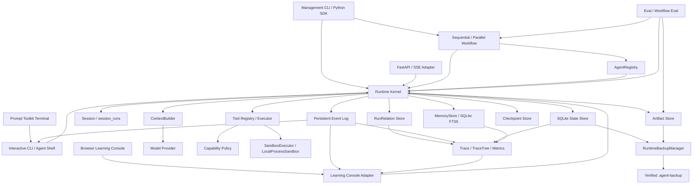

核心依赖方向由入口指向 Runtime，再由 Runtime 依赖抽象化的 Provider、Tool 和 Store；模型厂商响应和具体工具实现不进入 Runtime Kernel 的领域模型。

## 2.1 本地稳定启动层

标准本地服务不再要求调用方自行拼装 Runtime：

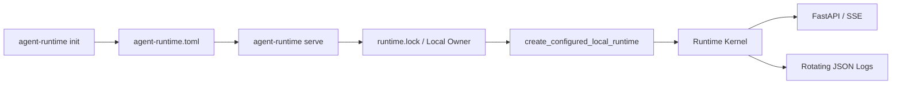

`LocalRuntimeSettings` 将 TOML、`AGENT_RUNTIME_*` 环境变量和 CLI override 规范化为不可变配置；优先级为 CLI、环境变量、TOML、默认值。配置只保存 API Key 的环境变量名称。

`LocalRuntimeLock` 在 Runtime 构造前打开 `runtime.lock`，并在整个服务生命周期内持有操作系统级非阻塞排他文件锁；JSON 元数据记录 PID、主机、版本、启动时间和随机 token。第二个 `serve` 无法获得排他锁时立即拒绝。进程被强杀后，操作系统自动释放锁，下一次启动覆盖遗留元数据；Windows Process Handle 只用于只读状态判断。该锁只约束标准本地服务，不是跨主机 Lease。

`configure_structured_logging()` 同时配置 stderr 和有界 `RotatingFileHandler`。FastAPI 模块的 Uvicorn 默认 `app` 使用惰性 ASGI 包装器，import Adapter 时不再创建隐藏 SQLite 或 Runtime。

## 2.2 Interactive CLI Adapter

v0.8.2 在本地启动层之上增加 embedded Interactive CLI。它是 Runtime 外部 Adapter，不把提示符、颜色、Slash Command 或终端状态写进 Runtime Kernel：

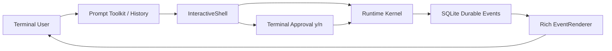

`agent-runtime chat` 与 `serve` 使用同一 `LocalRuntimeLock`，因此一个状态目录仍只有一个执行 Owner。每次用户输入创建独立 Run，并关联到一个持久化 Session；CLI 通过 metadata 显式设置 `include_session_history=true`，Runtime 才会把同 Session、同 Agent、已完成 Run 的 user input 与 final assistant result 重建为模型消息。默认最多加载 20 个历史 Run，上限 100；旧 Tool Call、Tool Result 和内部 Event 不作为下一轮模型上下文回放。

Runtime 为这次上下文装配写入 durable `session.history.loaded` Event。Prompt Toolkit 的 `<state_dir>/cli-history` 只用于方向键和自动建议，不属于 Runtime Session、Checkpoint 或恢复事实。Rich Renderer 消费 `Runtime.stream()`，默认显示 `model.delta`、Tool、Approval 和终态，隐藏 Context/Checkpoint 等内部噪音；`--print` 则只输出最终可消费文本。

v0.8.9 将 Renderer 进一步分为内容缓冲和事件投影两层。连续 `model.delta` 组成一个 Assistant Markdown 段；Renderer 只在空行或 fenced code block 闭合形成稳定 Markdown 块后 append 一次，不再通过 ANSI 光标控制重写旧终端行。Tool、Approval、完成证据和终态作为段边界并刷新剩余内容；`--print` 丢弃所有中间投影并只打印最终 `AgentRun.result`。Tool 事件默认进入 compact summarizer，verbose 才展开有界 JSON/多行结果：

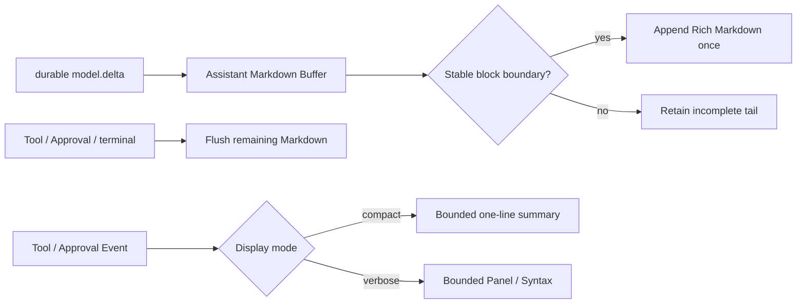

Display mode 只属于 Shell Adapter，不写入 Run、Session 或 Event；完整执行事实继续由 SQLite Event 与 ToolExecution 提供。

v0.8.10 在同一投影层增加执行透明度。Renderer 根据既有 Tool Event 确定性派生 Inspecting、Editing、Verifying 和 Executing 阶段，只在阶段转换时 append；`approval.requested` 生成 Tool-aware 有界预览，`approval.resolved` 显示批准或拒绝；`completion.evidence` 生成独立 Task Summary，将模型解释与 changed files、Git diff、validation command、failed/rejected Tool 等 Runtime 事实分离：

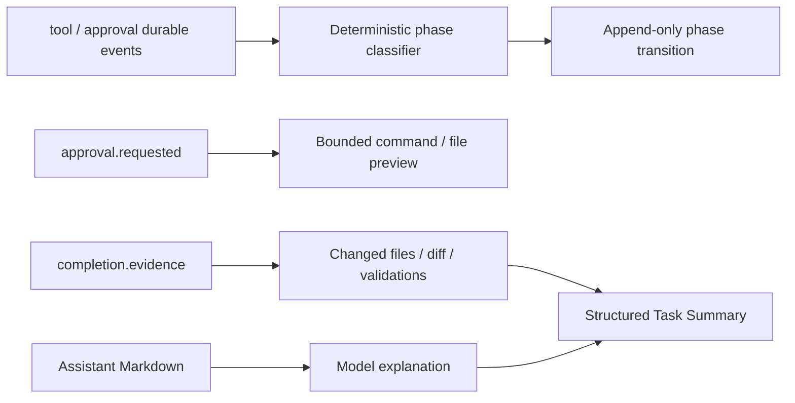

v0.8.11 修复 Approval 恢复期间的 Adapter 竞态。`resolve_approval()` 写入 durable Event 后，Shell 启动 `runtime.resume()` 并等待 Run 离开瞬时 `waiting_for_approval`，然后继续从最后 sequence 消费同一 Run；不会因为 `pending_approval` 已清空但状态尚未切换而提前结束投影。该修复不改变 Runtime 状态机或 Event schema。内建 Coding Protocol 同时将 Runtime Approval 定义为副作用 Tool 的唯一确认步骤；失败的无写入任务仅在 CLI 视图中显示为 `incomplete`，底层 `completion.evidence.status=read_only` 保持兼容。

v0.8.12 继续保持该 Adapter 边界：Completion Policy 与 Renderer 共用同一个确定性 validation classifier，使 `python scripts/check_docs.py`、`check_coverage.py`、`verify_distribution.py` 和 `verify_local_runtime.py` 同时进入 durable validation evidence 与终端 `Verifying changes` 阶段。Renderer 根据同一轮 Tool Event 顺序区分 recovered 与 unresolved failure；同名 Tool 后续成功时只显示轻量恢复提示，最后一次仍失败时继续显示 `Task incomplete`。该投影不修改 ToolExecution、Completion Evidence 或 SQLite schema，也不从模型文本推断 clarification 状态。

v0.8.13 在 Runtime Tool Loop 增加保守的只读收敛层：仅对固定白名单 Tool，以规范化 Tool 名和完全相同 arguments 查找当前 Run 中已完成的 ToolExecution；若中间没有副作用 Tool，则创建新的 completed ToolExecution、递增 `tool_call_count`、写入 durable `tool.reused` Event，并把原结果与 convergence note 返回模型，但不再次调用 handler。任何副作用 Tool 都会使此前候选失效；失败、UNKNOWN、Approval 和副作用调用永不复用。参数校验错误同时返回允许字段，错误相对路径返回有界 Workspace 候选。compact Renderer 对常见 inspection Tool 隐藏 requested 行，只显示 completed/failed/reused；verbose 仍保留完整生命周期。

v0.8.14 在该层之上增加 `_EvidenceLedger`。Runtime 从 durable ToolExecution 顺序重建搜索命中、文件行区间、Artifact 字符区间和稳定结果摘要；副作用 Tool 清空账本并关闭自动 finalization。默认 10 次 inspection 或连续 2 次无进展写入 `convergence.warning`，14 次 inspection、连续 3 次无进展或即将达到 `max_steps` 写入 `convergence.finalization_requested`。最终 Model 请求使用空 Tool Definition；未暴露 Tool 的调用绝不执行。两个 Event 和对应 system note 与 Checkpoint 一起持久化，CLI/Learning Console 只做确定性投影，不维护旁路计数。

v0.8.15 为当前 Run 的原始 user message 增加 Runtime 专用 name，并将它作为 ContextBuilder pinned group：即使 Session 历史、Tool 证据和 context summary 触发压缩，也不会省略或截断 durable `run.input`。触发 finalization 时，Checkpoint 额外保存一条 system 收敛说明和一条位于消息尾部、role 仍为 `user` 的原始请求重申；原始文本不会被提升为 system 指令。恢复旧 Checkpoint 时，Runtime 会从 durable `run.input` 补齐或标记当前请求。finalization 提示只要求忠实回答原问题和准确陈述实际动作，不再默认套用“workspace change 未完成”的编码任务模板。

v0.8.16 在无 Tool finalization 响应进入 Step 和 Run 终态前增加协议完整性检查。Runtime 只把主要或完整由 DSML、XML 或已知 Tool JSON envelope 构成的内容判定为文本化 Tool Call，绝不解析执行其中动作。首次命中会写入 detection Event、保存 repair Checkpoint、再次以 `tools=[]` 重申原请求；第二次命中抛出 `ProviderProtocolError`。finalization 的 Streaming delta 在校验前内部缓冲，成功答案再作为单个 durable `model.delta` 发布，避免终端和 SSE 先泄漏伪 Tool 语法。

v0.8.17 将 DSML 识别从字面前缀比较收紧为兼容归一化后的 envelope 校验。检测副本先执行 Unicode NFKC，将全角 `｜` 等兼容字符还原为 ASCII；marker 解析允许有限空白和一个以上竖线，以覆盖真实 Provider 返回的 `<｜｜DSML｜｜...>`、`<||DSML||...>` 及 spaced marker。原始模型内容不被改写，也不会进入 Tool Executor；只有整个非空响应仍主要由已知 DSML tag 行组成时才命中，因此附带自然语言解释的协议示例保持可回答。

v0.8.18 将 finalization 从“在原消息历史末尾追加无 Tool 提示”改为独立综合边界。Runtime 从 SQLite ToolExecution 生成纯文本 evidence digest，对完全相同的 Tool、arguments、status 和 result 做 SHA-256 去重，并按 `context_token_budget` 派生总字符上限；Session 历史只保留当前请求之前的纯文本 user/assistant 片段。新的模型输入不包含 Agent 原 system prompt、Assistant `tool_calls`、`role=tool` 消息或 Provider 私有协议，最后一条仍是完整 durable `run.input`。Evidence 被明确标记为不可信数据；首次文本 Tool Call 修复继续复用同一 Fresh Context。Runtime 只把计数、截断和去重统计写入 `convergence.finalization_context_built`，不把证据原文复制进 Event Payload。


> 最近更新：2026-08-19<br>
> 关联记录：[E2026-08-19-009](./CHANGELOG.md#e2026-08-19-009)、[E2026-08-19-007](./CHANGELOG.md#e2026-08-19-007)、[E2026-08-19-006](./CHANGELOG.md#e2026-08-19-006)、[E2026-08-19-005](./CHANGELOG.md#e2026-08-19-005)、[E2026-08-19-004](./CHANGELOG.md#e2026-08-19-004)、[E2026-08-19-003](./CHANGELOG.md#e2026-08-19-003)、[E2026-08-19-002](./CHANGELOG.md#e2026-08-19-002)、[E2026-08-19-001](./CHANGELOG.md#e2026-08-19-001)、[E2026-08-18-003](./CHANGELOG.md#e2026-08-18-003)、[E2026-08-16-006](./CHANGELOG.md#e2026-08-16-006)<br>
> 关联决策：[ADR-0040](./adr/0040-dsml-variant-detection.md)、[ADR-0039](./adr/0039-textual-tool-call-guard.md)、[ADR-0038](./adr/0038-finalization-context-integrity.md)、[ADR-0037](./adr/0037-evidence-aware-convergence.md)、[ADR-0036](./adr/0036-read-only-tool-convergence.md)、[ADR-0035](./adr/0035-interactive-cli-execution-transparency.md)、[ADR-0034](./adr/0034-interactive-cli-presentation.md)、[ADR-0027](./adr/0027-interactive-cli-session-history.md)

## 2.3 Project-aware Workspace Context

> Updated: 2026-08-17
> Change: [E2026-08-17-004](./CHANGELOG.md#e2026-08-17-004)
> Decision: [ADR-0031](./adr/0031-project-workspace-instructions.md)

Before AgentDefinition registration, local bootstrap loads configured root-relative UTF-8 instruction files, defaulting to `AGENTS.md` and `CLAUDE.md`. Files share a bounded character budget. Status projections contain path, SHA-256, character count, truncation, and skip reasons, but never content.

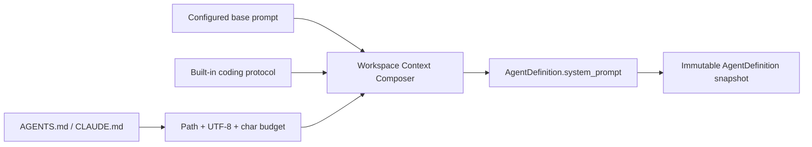

Project rules therefore become part of the exact startup Agent snapshot. Later file changes do not alter historical Run recovery; restarting the Runtime creates a new prompt snapshot.

## 2.4 Artifact-aware Reading 与 Workspace Discovery

> 最近更新：2026-08-18
> 关联记录：[E2026-08-18-001](./CHANGELOG.md#e2026-08-18-001)
> 关联决策：[ADR-0032](./adr/0032-artifact-paging-workspace-discovery.md)

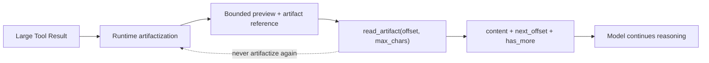

ArtifactStore 将大 Tool Result 保存在 `<artifact_root>/<run_id>/tool-results/`。`read_artifact` 只接受当前 Run 下的 Tool Result Artifact，支持绝对路径、Artifact root 相对路径或 `tool-results/...` 引用；路径 resolve 后必须仍位于当前 Run 边界。读取器以增量 UTF-8 decoder 顺序扫描文件，在不把完整正文注入模型上下文的前提下计算字符总数和 SHA-256，并返回最多 4000 字符的页面。

Runtime 的首次大结果仍写入 Artifact 和 `tool.result.artifactized` Event，但返回给模型的 Tool Message 同时包含 `read_artifact` 调用方法。来自 `read_artifact` 的结果具有显式非递归标记，因此即使接近 inline threshold 也不会再次 Artifact 化。标准 `read_text_file` 知道本地 Artifact root，若指向当前 Run Tool Result Artifact，会拒绝并提示使用专用 Tool。

Workspace discovery 同时收紧默认噪声：目录过滤 `.runtime-test-data`，文件过滤 `.coverage` 与 `coverage.json`。`list_files`、`search_text` 和内建 Coding Protocol 约定，广泛发现被截断时应缩小 path/pattern 或按符号搜索，而不是结束任务；目标能从当前请求或 Session 历史推断时，不要求用户重复说明。

## 2.5 Verified Task Completion

> 最近更新：2026-08-18<br>
> 关联记录：[E2026-08-18-002](./CHANGELOG.md#e2026-08-18-002)<br>
> 关联决策：[ADR-0033](./adr/0033-verified-task-completion.md)

标准本地 Runtime 在 Runtime Kernel 外挂载可选 `CodingCompletionPolicy`。普通 Runtime 不启用时仍保持“模型无 Tool Call 即完成”的兼容语义。本地 Coding Run 发生文件写入后，Policy 从持久化 ToolExecution 派生完成证据：

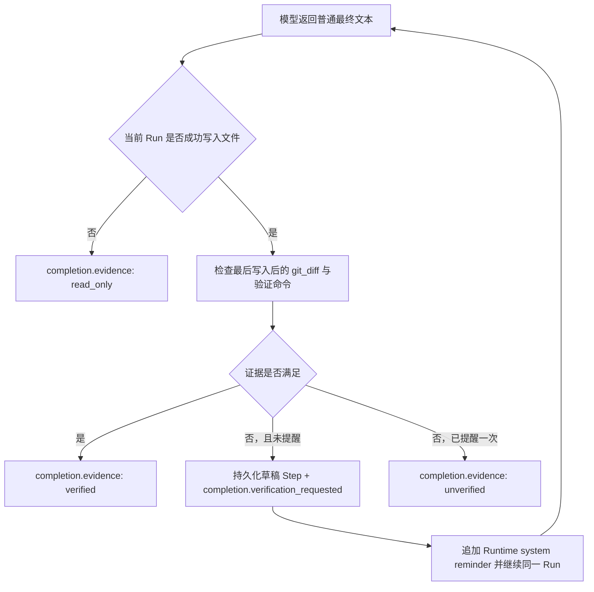

该机制不自动执行 diff 或测试，只允许模型继续调用已有 Tool；成功事实来自 ToolExecution 状态和 `run_process` exit code。提醒次数通过 durable Event 判断，因此恢复后不会重复进入无限循环。最终证据在 `run.completed` 前写入 Event Log，CLI、SSE、Eval 和观测 Adapter 可以统一消费。

## 3. Runtime Kernel

`Runtime` 负责：

- 通过 `AgentRegistry` 注册、发现并校验 `AgentDefinition`，同时将规范化定义保存为内容寻址的不可变快照。
- 创建、启动、等待和恢复 `AgentRun`，并为每个 Run 注入稳定 `trace_id` 和 `agent_definition_checksum`。`submit()` 支持 durable idempotency key。
- 执行有最大步数和最大工具调用数的 Agent 循环，并通过活动 Run 上限与模型请求 Semaphore 实施背压。
- 将模型响应规范化为文本或 `ToolCall`。
- 触发工具执行、人工审批和 Checkpoint。
- 将完成、失败、暂停和取消收敛为明确 Run 状态。
- 将关键动作写入持久化 Event Log。
- 通过 `delegate()` 创建独立 Child Run，并使用稳定 delegation key 实现幂等委派。
- Parent Cancel 递归传播到活动 Child Run。
- 创建 Session、关联 Run，并让 Child Run 继承 Parent Session。
- 在模型调用前检索 Scoped Memory，并通过 ContextBuilder 构造受预算输入。
- 将大 Tool Result 转存到 Artifact Store。

公开入口包括 `run()`、`submit()`、`start()`、`wait()`、`stream()`、`pause()`、`resume()`、`cancel()`、`delegate()`、`begin_workflow()`、`finish_workflow()`、`resolve_approval()`、`resolve_unknown_tool()`、`resume_workflow()`、`create_session()`、`session_runs()`、`remember()`、`search_memory()`、`forget_memory()` 和 `purge_expired_memories()`。

## 3.1 Multi-Agent Orchestration

v0.6 在单 Agent Kernel 外增加 `agent_runtime.orchestration`，但每个 Child 仍通过同一个 Runtime Kernel 执行：

- `AgentRegistry`：保存当前进程可委派的 AgentDefinition；SQLite 保存不可变 AgentDefinition 快照，恢复时按 checksum 绑定历史定义。
- `RunRelation`：保存 Parent、Child、Root、关系类型、delegation key 和 metadata。
- `Runtime.delegate()`：先按 `parent_run_id + delegation_key` 查重，再创建或复用 Child Run。
- `SequentialWorkflow`：按稳定 step key 顺序执行，并把上一步结果传给下一步。
- `ParallelWorkflow`：使用 Semaphore 限制并发，支持 timeout、`all`、`best_effort` 和 `first_success`。
- `WorkflowExecution`：返回 Parent Run 和 Child Run 列表。

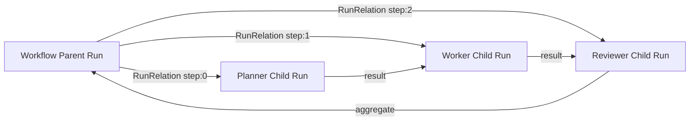

Parent 和 Child 都有独立 Run ID、Trace ID、Event 和 Checkpoint。Root Run 的 `root_run_id` / `root_trace_id` 负责把整棵树关联起来；Child 自己的 `trace_id` 不与 Parent 混用。

首次委派在一个 SQLite 事务中写入 Child Run、RunRelation、Parent `delegation.created` 和 Child `run.created`。恢复时，如果稳定 delegation key 已存在，Runtime 复用原 Child；这避免 Parent 恢复后重复执行同一委派。

## 3.2 Context、Session 与 Memory

v0.7 在完整 Checkpoint 历史与 Model Provider 之间增加 Context Build 层：

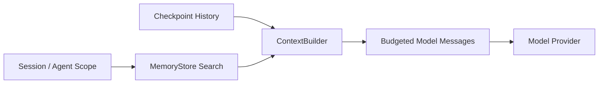

`ContextBuilder` 只构造模型输入副本，不修改 Checkpoint。它使用 Provider-neutral 近似 token 估算，并按以下优先级选择消息：System Prompt、当前 Run 原始请求、finalization 请求重申、未完成 Tool Call 组、最近消息组、预算允许的旧消息。Assistant Tool Call 与对应 Tool Result 作为不可拆分组；被省略的旧消息生成确定性 Summary。

Session 是多个 Run 的显式持久化容器。`sessions` 保存 Session 本身，`session_runs` 保存一对多关系；一个 Run 最多属于一个 Session，Child Run 继承 Parent 的 Session。

`MemoryStore` 协议隔离检索实现。当前 `SQLiteStore` 通过 FTS5 实现关键词搜索，只允许：

- `session` Scope：仅指定 Session 可见。
- `agent` Scope：仅指定 Agent 可见，可跨 Session。

Memory Record 保存 content、Scope、source Run、source Trace、TTL、软删除时间和 metadata。Runtime 不自动保存全部对话，必须由应用显式调用 `remember()`。

每次模型调用的处理顺序为：

```text
Checkpoint messages
+ allowed Session/Agent scopes
→ memory.search.started/completed
→ ContextBuilder.build()
→ context.built / context.compacted
→ Model Provider
```

Context 与 Memory 的完整说明见 [CONTEXT_MEMORY.md](./CONTEXT_MEMORY.md)。

## 4. Run 状态机

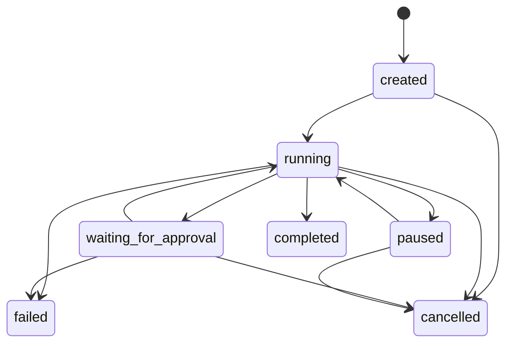

非法状态迁移由领域模型拒绝。`completed`、`failed` 和 `cancelled` 是终态。

## 5. Model Provider 层

`ModelProvider` 协议接收统一的 `Message`、`ToolDefinition` 和 `ModelConfig`，返回 `ModelResponse`。Runtime 只理解：

- 文本内容。
- 结构化工具调用。
- finish reason。
- token usage。

当前实现：

- `MockProvider`：确定性测试和本地 Demo。
- `OpenAICompatibleProvider`：复用受管理的 `httpx.AsyncClient` 调用 Chat Completions 兼容端点。

Provider 调用由 Runtime 统一处理超时和指数退避重试。实现 `StreamingModelProvider` 的 Provider 可以输出 `ModelTokenDelta`；Runtime 在不改变既有 Run / Step / ToolExecution / Checkpoint 语义的前提下，将增量写入 `model.delta` 事件，并在模型步骤结束时合并为完整 `ModelResponse`。不支持 `stream()` 的 Provider 自动回退到 `complete()`。

## 6. Tool Executor

工具由 `ToolDefinition`、handler 和超时组成，通过 `ToolRegistry` 注册。执行前进行基础 JSON-schema 风格校验，执行结果统一转换为 `ToolResult`。

当前支持：

- 同步和异步 Python handler。
- required、type、enum 和 additionalProperties 校验。
- 单工具超时。
- 工具异常标准化并回传给模型；参数错误包含允许字段，常见错误路径包含有界 Workspace 候选。
- 当前 Run 内完全相同的白名单只读 Tool 可复用 durable 结果；副作用调用后候选失效。
- `requires_approval` 人工审批标记。
- `side_effecting` 副作用标记。
- `capabilities` 与 `sandbox_only` 安全声明。
- `CapabilityPolicy` 合并 allow、deny、require_approval 与 sandbox_only。
- `CancellationToken` 协作式取消和稳定的 `idempotency_key`。

## 6.1 SandboxExecutor 与 Capability Policy

v0.8.0 在 Tool Handler 之前增加显式授权层。默认 capability 规则为 `file.read=allow`、`file.write=require_approval`、`process.exec=sandbox_only`、`network.access=deny` 和 `secret.read=deny`。deny 优先于其他动作；要求 Sandbox 的 Tool 必须以 `sandboxed=True` 注册。

`LocalProcessSandbox` 通过 `asyncio.create_subprocess_exec()` 运行 argv，不使用 shell；显式限制可执行文件、Workspace cwd、环境变量、timeout、输出字节和并发。Run Cancel、输出超限、超时与 Runtime shutdown 会终止进程树。它当前不提供网络、CPU、内存、PID 或系统调用强隔离。

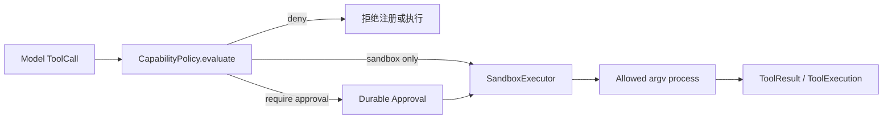

Capability 决策通过 `tool.policy.evaluated` 进入 durable Event Log；Sandbox active process 与容量通过 `Runtime.sandbox_snapshot()`、CLI `observe sandbox` 和 HTTP `/observability/sandbox` 暴露，但不占用 Run sequence。完整边界见 [SANDBOX.md](./SANDBOX.md)。

> 最近更新：2026-08-16
> 关联记录：[E2026-08-16-005](./CHANGELOG.md#e2026-08-16-005)、[E2026-08-16-004](./CHANGELOG.md#e2026-08-16-004)
> 关联决策：[ADR-0026](./adr/0026-local-runtime-bootstrap-single-owner.md)、[ADR-0025](./adr/0025-local-process-sandbox-capability-policy.md)

## 6.2 Coding Workspace Tool Loop

v0.8.5 在 Tool Registry 之上提供标准本地 Coding Tool 组合，但不修改 Runtime Kernel 的执行循环：

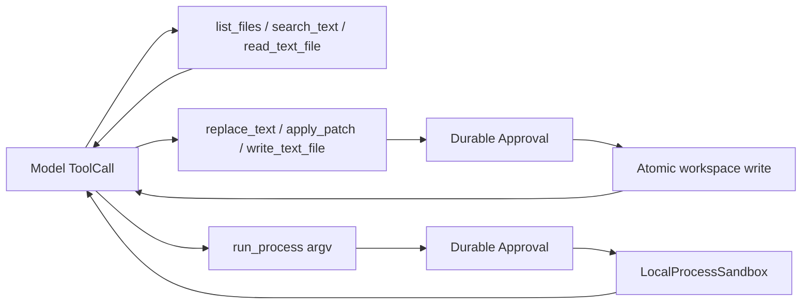

`list_files` 返回排序、相对、有限的 Workspace 路径并跳过常见生成目录；`search_text` 对 UTF-8 文本执行有界扫描；`read_file_lines` 按行和字符预算读取；`replace_text` 处理单文件精确替换；`apply_patch` 在全部 edit 预验证后批量修改已有文件，并返回每个文件的前后 SHA-256。只读 `git_status`、`git_diff` 复用 LocalProcessSandbox，禁用 external diff/textconv 并限制输出。文件读操作声明 `file.read`；文件修改声明 `file.write`、`requires_approval` 与 `side_effecting`。

标准 `create_configured_local_runtime()` 将 Coding Tool 与已有 `run_process` 一起加入本地 AgentDefinition。`run_process` 继续只接收 argv，由 TOML 配置白名单、timeout、输出和并发；Interactive CLI 的 `/workspace` 与 `/diff` 只读取 AgentDefinition 和 ToolExecution，不复制执行状态机。

> 最近更新：2026-08-17
> 关联记录：[E2026-08-17-003](./CHANGELOG.md#e2026-08-17-003)、[E2026-08-17-002](./CHANGELOG.md#e2026-08-17-002)、[E2026-08-17-001](./CHANGELOG.md#e2026-08-17-001)
> 关联决策：[ADR-0030](./adr/0030-bounded-read-batch-patch.md)、[ADR-0029](./adr/0029-read-only-git-workspace-tools.md)、[ADR-0028](./adr/0028-coding-workspace-tools.md)

## 7. SQLite、Step、ToolExecution、Checkpoint 和 Artifact Store

`SQLiteStore` 当前保存：

```text
schema_migrations
runs
events
checkpoints
approvals
steps
tool_executions
run_relations
sessions
session_runs
memory_records
memory_fts
```

数据库启用 WAL 和 foreign keys，并通过编号 migration 初始化和升级 schema。当前 schema version 为 `8`；`run_relations` 对 `child_run_id` 和 `parent_run_id + delegation_key` 建立唯一约束，`session_runs` 限制一个 Run 最多属于一个 Session，`memory_fts` 为活动 Memory 提供 FTS5 索引。`Step` 表示一次模型决策，`ToolExecution` 表示该决策内有序的工具调用。

ToolExecution 保存参数、状态、结果、错误、审批关系、side-effect 标记和 idempotency key。工具完成状态、Run 计数、Checkpoint 和对应 Event 可以在同一 SQLite 事务中提交，降低半状态风险。

Checkpoint 保存恢复所需的消息历史、模型步骤和工具调用计数。`ArtifactStore` 将大文本产物写入按 Run 隔离的目录；当 Tool Result 超过配置阈值时，Runtime 自动保存完整 Artifact，并让 ToolExecution 与 Checkpoint 只保留路径、大小和预览。


## 7.1 在线备份与离线恢复

`RuntimeBackupManager` 位于 Runtime Kernel 外部，操作状态文件而不参与 Run 状态机：

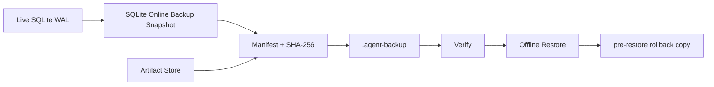

创建备份时先使用 SQLite Online Backup API 获得事务一致数据库，再复制 Artifact，记录 format version、schema version、migration checksum、关键表计数、文件大小和 SHA-256。生成的临时归档必须通过完整自校验后，才能原子替换最终备份文件。

恢复不允许在活动 Runtime 上执行。恢复器先校验 ZIP 路径、重复 Entry、hash、`quick_check`、`foreign_key_check` 和 migration，再执行 WAL checkpoint 与排他锁检查。目标数据库和 Artifact 先改名为 `pre-restore-*`，安装失败则自动回滚；默认保留恢复前副本。

当前历史记录保存绝对 Artifact 路径，因此恢复目标必须与 Manifest 中的原路径一致。该边界避免在 JSON、Event 和消息文本中进行不安全的全库字符串替换。
## 8. Event Log

每个 Run 的事件使用从 1 开始的单调递增 `sequence`。当前事件覆盖：

```text
run.created / started / recovered / paused / completed / failed / cancelled
model.requested / stream.started / delta / stream.completed / stream.failed / completed
tool.policy.evaluated / requested / started / completed / failed / rejected / cancelled / outcome_unknown / unknown_resolved
checkpoint.created
approval.requested / resolved
step.completed
workflow.started / recovered / resumed / completed / failed / cancelled
delegation.created / completed / failed / cancelled
memory.search.started / completed
context.built / compacted
tool.result.artifactized
```

`Runtime.stream()` 轮询 SQLite 中的新事件并按 sequence 输出。Provider 层的 `ModelTokenDelta` 是短生命周期增量；Runtime 将它映射为可审计的 `model.delta` 事件。最终 assistant message、Tool Call 和工具结果仍通过 Step / Checkpoint 持久化。Context Build、Memory Search 和 Tool Result Artifactization 也进入同一 Event Log。该接口为 SSE、WebSocket 或消息队列适配保留稳定消费边界。

## 9. API、SDK 与 CLI

Python SDK 暴露 Runtime 和领域对象，并提供本地 Demo runtime 构造函数。Interactive CLI 通过同一个 Runtime API 提供持久化多轮终端对话。

CLI 当前支持：

```text
agent-runtime init
agent-runtime chat
agent-runtime chat -c
agent-runtime chat -r <session-id>
agent-runtime chat -p "19 * 23"
agent-runtime serve
agent-runtime status
agent-runtime lab
agent-runtime demo
agent-runtime runs list
agent-runtime runs get
agent-runtime runs events
agent-runtime runs pause
agent-runtime runs resume
agent-runtime runs cancel
agent-runtime approve
agent-runtime resolve-unknown
agent-runtime observe metrics
agent-runtime observe trace <run-id>
agent-runtime eval demo
agent-runtime memory demo
```

核心 Runtime 不依赖 CLI、Prompt Toolkit、Rich 或 HTTP 框架。

## 9.1 Interactive CLI

`InteractiveShell` 将终端输入映射为持久化 Session 和独立 Run，通过 `Runtime.stream()` 渲染 `model.delta`、Tool 与 Approval 事件。Slash Command 只读取或调用公开 Runtime/Store 接口；终端审批调用 `resolve_approval()` 后再恢复同一 Run。活动 Run 期间的 `Ctrl+C` 触发协作式 `cancel()`，输入阶段的 `Ctrl+C` 只清空当前提示，`Ctrl+D` 保存持久化状态后退出。

`chat -c` 选择最近的 Interactive CLI Session，`chat -r` 使用指定 Session，`chat -p` 只输出最终结果后退出。默认 `--compact` 隐藏 Tool started 并显示工具感知的单行摘要；`--verbose` 或 `/display verbose` 展开有界参数、结果和失败详情。Embedded 模式优先复用现有本地 Bootstrap、Provider、ToolRegistry、SQLite 和 Owner Lock；当前不实现连接到正在运行的 HTTP daemon。Session 每一轮创建一个独立 durable Run；`--continue`/`--resume` 只选择已有 Session，不重新提交已完成 Run。Runtime 重启后的历史只重建有界的已完成 Run 上下文；副作用 Tool 的未知结果继续遵守 Runtime 的 UNKNOWN 语义。Renderer 按当前 Run 的 durable Event sequence 丢弃重放事件，避免断线/恢复消费造成重复输出；`begin_turn()` 会重置游标，因此不同轮次的 sequence 可以独立从 1 开始。

## 9.2 FastAPI Run API 与 SSE

FastAPI 位于 Application / Adapter Layer，只调用 Runtime、SQLiteStore 和 Runtime.stream()，不直接实现模型循环、工具执行或 SQLite 连接操作。

- `POST /runs` 创建并异步启动 Run，返回 `202 Accepted`，并可接收 `session_id`。
- `GET /runs/{run_id}` 查询持久化 Run 状态。
- `GET /runs/{run_id}/events` 读取按 sequence 排序的历史事件。
- `GET /runs/{run_id}/events/stream?after_sequence=N` 通过 SSE 轮询 `Runtime.stream()`，使用 Event sequence 作为 SSE id，支持断点续传。
- `POST /runs/{run_id}/pause|resume|cancel` 复用 Runtime 生命周期控制。
- `GET /runs/{run_id}/approvals/pending` 与 `POST /approvals/{approval_id}/resolve` 完成人工审批。
- `GET /agents` 查询 AgentRegistry。
- `POST /runs/{parent_run_id}/delegations` 通过正式 Runtime 路径创建或复用 Child Run。
- `GET /runs/{run_id}/relations` 查询 Parent 和直接 Child 关系。
- `GET /runs/{run_id}/trace/tree` 从 Parent 或任意 Child 查询完整 Trace Tree。
- `/sessions` 与 `/sessions/{session_id}/runs` 创建和查询 Session。
- `/memories` 与 `/memories/search` 提供显式写入、检索、删除和过期清理。

v0.4 起，SSE 仍然只有一个事件流协议；客户端根据 `type` 区分 `model.delta`、`tool.completed` 等事件。`model.delta` 是持久化 Runtime Event，因此支持 `after_sequence` 断点续传；Provider 不支持 streaming 时，Runtime 会回退为一次性的完整响应事件。

## 9.3 Observability、Trace 与 Metrics

`ObservabilityService` 不侵入 Runtime 状态机，而是从 `SQLiteStore` 中已经持久化的 Run 和 Runtime Event 派生观测结果：

- `RunTrace`：包含一个 Run root span，以及 Model、Tool、Approval 子 span。
- `TraceTree`：使用 `RunRelation` 将多个独立 RunTrace 组合为 Parent/Child 树。
- `MetricsSnapshot`：包含 Run 状态分布、Root/Child/Workflow/Delegation 计数、Session/Memory 数量、Memory Search、Context Compaction、事件计数、模型/工具/审批次数、token usage、Run/Model/Tool 平均与 p95 延迟，以及 Provider/Tool/UNKNOWN 失败分类。
- Prometheus 文本：通过固定 `agent_runtime_*` 指标名称导出。

每个新 Run 的 metadata 自动包含 `trace_id`。Trace Span 使用事件 sequence 和 timestamp 构造，因此可以回溯到原始事件，但当前没有修改 SQLite Event schema，也没有依赖 OpenTelemetry SDK。

FastAPI 暴露：

- `GET /observability/metrics`。
- `GET /observability/metrics/prometheus`。
- `GET /runs/{run_id}/trace`。
- `GET /runs/{run_id}/trace/tree`。

## 9.4 Eval Runner

`EvalRunner` 使用与生产执行相同的 Runtime 路径逐个运行 `EvalCase`，不会绕过 Provider、Tool、Checkpoint 或 Event Log。每个 Eval Run 的 metadata 保存 `eval_report_id`、`eval_suite` 和 `eval_case`，因此评估结果可以反查完整 Trace 和事件。

`MemoryEvalRunner` 复用相同 Eval Report 和 Artifact 机制，可验证关键词查询命中内容与 `expected_memory_count`。

当前内置评估器：

- `ExpectedStatusEvaluator`：检查 Run 最终状态。
- `ExactMatchEvaluator`：检查最终文本精确匹配。
- `ContainsEvaluator`：检查最终文本包含指定片段。

`EvalReport` 汇总用例级断言、通过率、Run ID、Trace ID 和耗时，并写入 Artifact Store。`WorkflowEvalRunner` 通过真实 Workflow 路径运行用例，并可断言 Parent 状态、输出和 Child Run 数量。

v0.8.19 新增 `RealModelAcceptanceRunner`。它不在调用者 Workspace 直接运行，而是为每个 Case 创建隔离合成 Git Workspace、独立 SQLite 和 Artifact，然后复用 configured Local Runtime 的真实 Provider、Coding Tool、Approval 与 resume 路径。报告从 durable Run/Event/ToolExecution 派生 completion、convergence、Tool efficiency、protocol integrity、verification 和 lifecycle 指标；默认只保存结构统计、Run/Trace ID、Tool 名称、最终答案长度与 SHA-256，不保存 Prompt、Fixture、Tool 参数/结果或答案原文。Suite checksum、Runtime version 和模型名使多次报告可以比较。当前 Case 串行执行以减少干扰，尚未实现统计显著性或 LLM-as-a-Judge。v0.8.22 新增 `compare_acceptance_reports`，只在报告层对齐 `case_name + attempt` 并执行离线回归 Gate；它不创建 Runtime、不读取 Case SQLite，也不触碰 Provider。

v0.8.27 在上述 Scope 合同之外，为每份报告增加非敏感 `manifest`：`runtime_version`、`git_commit`、`python_version`、`platform`、`provider`、`model`、`suite`、`cases`、`repeat`、`started_at` 和 `finished_at`。Runner 从当前进程和工作区采集这些事实；Git 不可用时写入 `null`，其余缺失环境字段写入 `unknown`。Manifest 差异由 compare 返回为 `manifest_differences`，只用于诊断和复现，不自动变成 regression。旧报告没有 `manifest` 时从既有顶层字段和 `selection` 兼容读取。

v0.8.23 将 Acceptance Scope 变成比较前的显式不变量：Runner 在报告 `selection` 中保存 `case_names`、`repeat`、`expected_attempts` 和 `actual_attempts`。默认 strict compare 必须先确认 suite identity、selection 元数据和完整的 `(case_name, attempt)` 集合完全一致，只有通过后才执行回归断言；范围不一致返回 `incompatible`，不再把额外或缺失 Attempt 降级为 warning 后假设通过。CLI 只有在显式重复传入 `--case` 时才进入 partial compare，结果标记为 `partial`，并要求选中 Case 的 Attempt 集合在两份报告中一致。旧报告缺少 selection 时允许基于结果推断，但必须产生兼容性 warning，不能把它当作新格式基线。

v0.8.20 将修改验证证据进一步区分为 tracked diff 和 untracked status。`write_text_file` 的 durable result 兼容性增加 `created`；Completion Policy 和 Acceptance 指标在检测到新建文件、且 Runtime 提供 `git_status` 时，要求最后一次写入后成功执行 `git_status`。这是因为 `git diff` 默认不会展示未跟踪文件，单独调用它不能证明新文件已进入 Workspace。该规则不自动 stage/commit，也不改变普通 SDK 在未注册 Git Tool 时的行为。真实基线 `deepseek-v4-flash` 在 5 Cases × 3 repeats 中达到 15/15 attempts、0 failed assertions，正是对其 durable ToolExecution 深挖后发现这一证据缺口。 v0.8.21 继续沿用同一时间边界：Acceptance 只从最后一次成功写入之后的 ToolExecution 计算 `git_diff`、`git_status` 和 validation；写入前的检查不会被重新解释为修改后的验证。v0.8.29 在 Completion Evidence 中补充写入前/后 Git status 快照、`before_sha256`/`after_sha256`/`changed`/`created` 和 tracked/untracked/deleted/renamed 分类；快照用于展示 Workspace 事实，不把用户已有 dirty 文件归因给 Agent，且 no-op 写入不能被验证命令成功单独标记为 `verified`。v0.8.30 复用既有 `scripts/verify_distribution.py` 作为 Release Candidate 入口：先检查源码、文档、Learning Console 和 Wheel metadata 的版本一致性，再在干净虚拟环境执行 CLI、SDK、FastAPI/Uvicorn、SSE、备份和诊断 smoke；结果可输出为非敏感 JSON。

> 最近更新：2026-08-22<br>
> 关联记录：[E2026-08-22-007](./CHANGELOG.md#e2026-08-22-007)、[E2026-08-22-006](./CHANGELOG.md#e2026-08-22-006)、[E2026-08-21-002](./CHANGELOG.md#e2026-08-21-002)、[E2026-08-21-001](./CHANGELOG.md#e2026-08-21-001)、[E2026-08-20-002](./CHANGELOG.md#e2026-08-20-002)、[E2026-08-20-001](./CHANGELOG.md#e2026-08-20-001)<br>
> 关联决策：[ADR-0051](./adr/0051-release-candidate-verification.md)、[ADR-0050](./adr/0050-workspace-evidence-boundary.md)、[ADR-0044](./adr/0044-post-change-verification-boundary.md)、[ADR-0043](./adr/0043-new-file-verification-evidence.md)、[ADR-0042](./adr/0042-real-model-acceptance-baseline.md)

### Acceptance Scope Integrity

> 最近更新：2026-08-21
> 关联记录：[E2026-08-21-003](./CHANGELOG.md#e2026-08-21-003)
> 关联决策：[ADR-0046](./adr/0046-acceptance-scope-integrity.md)

Acceptance 报告的 `selection` 是报告自身的范围合同，而不是 UI 展示字段：

```text
selection.case_names       本次选择的 Case 名称（稳定排序）
selection.repeat           每个 Case 计划执行次数
selection.expected_attempts 计划的 Case × repeat 数量
selection.actual_attempts   实际落盘的 Attempt 数量
```

比较器采用两阶段流程：

1. **范围兼容性**：校验 suite identity、selection 完整性，以及两份报告的 `(case_name, attempt)` 集合。
2. **行为回归**：仅对范围已兼容的 Attempt 检查失败、断言退化、协议违规和 UNKNOWN Outcome。

因此，默认 `agent-runtime eval compare baseline candidate` 是全量严格比较；范围不一致输出 `incompatible` 并使用退出码 `2`。需要只比较明确子集时，调用方必须显式传递一个或多个 `--case`；此时结果输出 `scope: partial` 和 `status: partial`，且所选 Case 在两份报告中的 Attempt 集合仍必须一致。v0.8.24 对 partial compare 的非法 selection 使用缺失字段安全读取，保证报告问题返回 `incomplete_scope`/`incompatible`，不把格式错误升级为 CLI 未处理异常。比较器保持离线纯函数边界，不执行 Runtime、不读取验收 Workspace、不发送 Provider 请求。 v0.8.25 在 Runner 创建隔离报告目录前检查 OpenAI-compatible Provider 配置的 API Key 环境变量；缺失配置直接返回明确的 `AcceptanceSuiteError`，不创建验收产物、不启动 Runtime、不调用 Provider，也不读取或记录 Key 值。 v0.8.26 将同一检查前移到 CLI 的日志配置和 Owner Lock 获取之前，避免配置错误创建日志目录或短暂占用本地 Runtime Owner。SDK/Runner 入口仍保留重复检查，防止绕过 CLI。

## 9.5 Learning Console

Learning Console 是 `agent_runtime.lab` 中的教学 Adapter，通过 `create_app(..., enable_learning_console=True)` 挂载到 `/lab`。默认 `create_demo_app()` 和 `agent-runtime lab` 会启用该 Adapter。

组成：

- `ScenarioRegistry`：保存 9 个场景的默认输入、预期事件、学习点、人工动作提示和数量验收条件。
- 单 Run 场景 Runtime：纯文本、Tool Calling、Token Streaming 和 Human Approval。
- v0.6 Workflow 场景：真实运行 `SequentialWorkflow` 和 `ParallelWorkflow`，生成 Parent、Child、RunRelation 和 TraceTree。
- v0.7 Context/Memory 场景：真实创建 Session/Memory、触发检索与 Context Compaction，并将大 Tool Result 写入 Artifact Store。
- `LearningConsole`：启动场景，根据 Root Run metadata 定位 Runtime，并聚合 Root/Child Snapshot。
- Lab FastAPI Routes：提供场景目录、启动、Snapshot 和审批接口。
- Static UI：根据 Snapshot 动态生成 Workflow Parent、每个 Child Agent 和实际出现的领域泳道，并提供 Event、State、Messages、Execution、Trace、Context、Memory、Artifact、SQLite、Acceptance 检查器。

所有场景 Runtime 共享现有 SQLiteStore，但不共享 Provider 行为。Run、Relation、Event、Step、ToolExecution、Approval、Checkpoint、Session、Memory 和 Artifact 仍是唯一执行事实；教学解释、`timeline_sequence` 和状态投影只用于展示，不回写领域状态。

Snapshot 先通过 `root_run_id` 和 `relations_for_root()` 找到完整 Run Tree，再逐 Run 读取 Event、Checkpoint、Step 和 ToolExecution。每个 Run 的事件先独立执行状态投影，再按 timestamp、run_id、local sequence 合并为教学 Timeline。前端显示的 `timeline_sequence` 是跨 Run 展示序号，SQLite 中每个 Run 的 `RuntimeEvent.sequence` 仍保持独立单调递增。

Root 事件实时通知复用 `/runs/{run_id}/events/stream`。因为 Child Run 保留独立 Event Stream，页面在 Parent 运行期间每 450ms 刷新聚合 Snapshot，从而动态显示 Child Model/Tool/Checkpoint；这属于本地教学投影，不新增 Runtime 消息总线。

泳道映射：Workflow/Root 生命周期与 Delegation 进入 Workflow Parent；每个 Child Run 根据 `workflow_step` 或 `workflow_branch` 排序并获得独立 Agent 泳道，其自身的 Run、Context、Model、Tool 和 Checkpoint 事件全部留在该泳道；非 Child 事件再按 Session/Memory、Context、Model、Tool、Approval 或 State 领域映射。只渲染当前 Snapshot 实际使用的领域泳道。

连线不再按跨 Run 全局相邻事件直接串接：同一 Run 按 `local_sequence` 连接内部执行线；`delegation.created → Child run.created` 形成委派分叉；`Child run.completed/failed/cancelled → delegation.completed/failed/cancelled` 形成结果汇聚。这样并行分支不会因为 `timeline_sequence` 相邻而被误表示为业务依赖。Trace Inspector 直接递归渲染 `TraceTree.root`，Context/Memory/Artifact Inspector 读取 Snapshot 的对应持久化事实。

事件“回放”只移动浏览器展示游标。它不会暂停 Runtime asyncio Task，也不会改变 Run 状态机、Event sequence 或恢复语义。该边界保证 Learning Console 可以随功能演进扩展，而 Runtime Kernel 不依赖 UI。

> 最近更新：2026-08-16
> 关联记录：[E2026-08-15-003](./CHANGELOG.md#e2026-08-15-003)
> 关联决策：[ADR-0011](./adr/0011-context-session-memory.md)、[ADR-0010](./adr/0010-parent-child-run-delegation.md)、[ADR-0009](./adr/0009-learning-console.md)
## 9.6 Operational Observability 与结构化日志

v0.7.11 将已有 Trace、Metrics、Runtime Doctor 和当前进程采样组合为 `OperationalSnapshot`，同时保持 durable facts 与 transient signals 分层：

- `Runtime.lifecycle_snapshot()`：状态、启动时间、uptime、活动任务和配置上限。
- `ToolRegistry.capacity_snapshot()`：同步 Tool worker、pending 上限与当前未完成 future。
- `ObservabilityService.diagnostics()`：合并 Runtime、Tool、PID、线程、asyncio Task、SQLite health、Doctor、Metrics 和最近失败。
- `StructuredLogFormatter`：输出 JSON Lines，对常见凭据字段脱敏，并限制字符串长度与嵌套深度。
- CLI `observe diagnostics` 与 HTTP `/observability/diagnostics`：提供相同诊断模型。

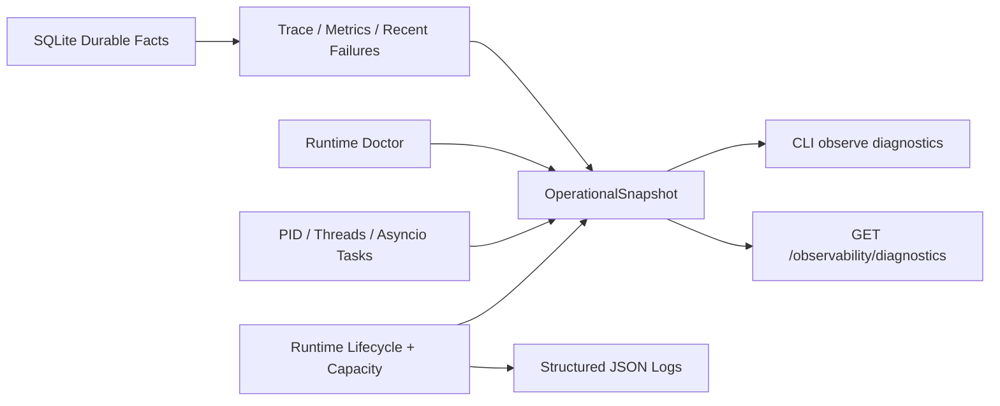

Provider attempt 失败和重试决定会改变一次 Run 的执行解释，因此 `model.attempt.failed` 与 `model.retry.scheduled` 进入 durable Event Log。Runtime 启停、PID、线程和 Task 数属于进程级信号，不占用 Run Event sequence。结构化日志默认关闭，不修改 root logger；CLI 通过 `--json-logs` 显式启用，Python 应用通过 `configure_structured_logging()` 配置。

> 最近更新：2026-08-16
> 关联记录：[E2026-08-16-005](./CHANGELOG.md#e2026-08-16-005)、[E2026-08-16-004](./CHANGELOG.md#e2026-08-16-004)、[E2026-08-16-002](./CHANGELOG.md#e2026-08-16-002)
> 关联决策：[ADR-0026](./adr/0026-local-runtime-bootstrap-single-owner.md)、[ADR-0025](./adr/0025-local-process-sandbox-capability-policy.md)、[ADR-0023](./adr/0023-operational-observability.md)、[ADR-0008](./adr/0008-observability-evals.md)
## 9.7 Incident Diagnostics 与 Support Bundle

v0.7.12 在 `OperationalSnapshot` 之上增加独立的 `IncidentDiagnosticsService`。该层只读取 Runtime 与 SQLite durable facts，生成可分享的安全摘要和 ZIP，不进入执行主循环，也不写入 Runtime Event sequence。

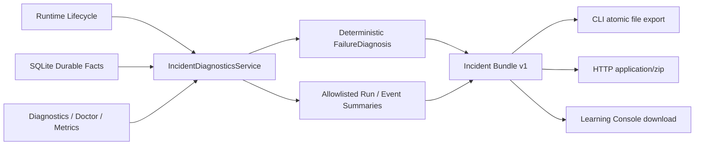

根因摘要只使用 durable failure events、HTTP status 和稳定错误类型，不调用模型。Provider 401/403、429、5xx、Timeout/Transport、Tool Failure、Tool UNKNOWN 与 Runtime Failure 使用固定类别和建议；Run 最终完成时标记 recovered。

默认支持包使用允许列表：Run 不暴露 input/result，Event 不暴露模型文本、Tool 参数/结果和原始 error；Memory、Checkpoint、Artifact、SQLite 和本机数据库/Artifact 路径不进入 ZIP。manifest 为数据条目记录 size 与 SHA-256，但诊断包不具备恢复语义。

CLI 文件导出先在内存构建 ZIP，再写入同目录临时文件并执行 flush/fsync 和 `os.replace`；存在目标默认失败。HTTP 直接流式返回内存 ZIP，并设置 `Cache-Control: no-store`。

> 最近更新：2026-08-16
> 关联记录：[E2026-08-16-003](./CHANGELOG.md#e2026-08-16-003)
> 关联决策：[ADR-0024](./adr/0024-incident-diagnostic-bundle.md)、[ADR-0023](./adr/0023-operational-observability.md)

## 9.8 Reliability、生命周期与发布门禁

- `shutdown(timeout_seconds=30, cancel_running=False)` 先停止接收新工作，再排空任务；超时后协作取消，不能确认的副作用 Tool 保持 `UNKNOWN`。
- `async with Runtime(...)` 自动执行相同关闭流程，重复关闭幂等。
- 同步 Tool 进入 Runtime 独享有界线程池；Provider 复用 `httpx.AsyncClient` 并在关闭时释放连接池。
- SQLite 使用 WAL、`synchronous=FULL`、`busy_timeout`、`quick_check` 和事务内 Event sequence；migration 带 checksum，只向前升级。
- Workflow 创建时保存规范化定义快照，恢复时由 Runtime 重建 Sequential/Parallel Workflow 并复用 delegation key；FastAPI 通过 `shutdown_runtime` 明确所有权；SSE heartbeat 不写 Event Log。

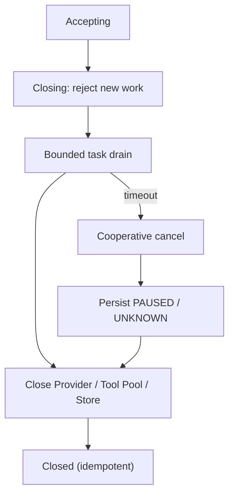

PR 执行静态检查、189 项测试、覆盖率、20 并发和 Wheel smoke；Nightly 执行 100 并发、故障测试重复、30 分钟 soak 和性能检查。
## 9.9 Runtime Doctor 与 Crash Recovery Matrix

`RuntimeDoctor` 是只读诊断层，不修改 SQLite。它检查 quick_check、schema、foreign_keys、非终态 Run、UNKNOWN/Running ToolExecution、Pending Approval、Event sequence、孤儿记录和 Workflow snapshot。CLI 使用 `agent-runtime doctor`，HTTP 使用 `GET /doctor`。

Crash Matrix 通过独立 Python 子进程制造模型请求中断、副作用 Tool 中断、Approval 等待中断和 Workflow 部分完成中断，再由新 Runtime 打开同一个 SQLite 文件进行恢复。副作用场景使用外部计数器证明恢复前后只执行一次。

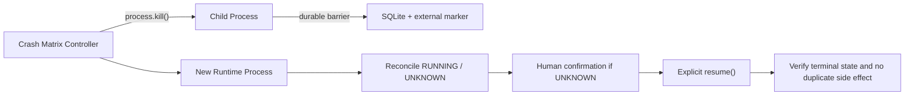

## 9.10 Backup CLI 与恢复门禁

CLI 提供：

- `agent-runtime backup create`：运行中创建数据库和 Artifact 归档。
- `agent-runtime backup verify`：离线校验归档，不修改 Runtime 状态。
- `agent-runtime backup restore --force`：所有 Runtime 停止后恢复，并默认保留回滚副本。

`scripts/run_backup_recovery.py` 创建恢复点后继续写入新 Run，再恢复旧备份，验证旧 Run/Artifact 存在而备份后的 Run 不存在。该脚本进入 PR 与 Nightly，Wheel smoke 也从安装产物执行 create、verify 和 restore。
## 10. 安全边界

当前默认安全策略：

- 工具必须显式注册，模型不能构造任意可执行函数。
- 文件路径先 `resolve()`，然后验证仍位于配置的 workspace 内。
- 写文件工具默认要求人工审批。
- 不提供任意 Shell 字符串或自动依赖安装；仅允许 Approval 后通过白名单 argv 启动受限本地进程。
- 工具参数必须通过 schema 校验。
- 模型 API Key 从构造参数或环境变量读取，不写入事件和数据库。

当前是进程级受控执行，不是针对恶意代码的强隔离沙箱。

## 11. 错误处理与恢复语义

- 模型错误：在配置次数内指数退避重试，耗尽后将 Run 标记为 failed。
- 工具错误：转换为工具消息并返回模型，使 Agent 可以重新规划。
- 工具超时：转换为 `ToolExecutionError`。
- Run 超时：执行循环终止并进入 failed。
- 暂停：保存最新 Checkpoint 后返回 paused。
- 审批：保存工具调用和 Checkpoint，批准后执行，拒绝后将拒绝原因作为工具结果返回模型。
- 恢复：加载最新 Checkpoint 和未完成 Step；已完成的 ToolExecution 复用持久化结果，不重复执行。Workflow Parent 可由 `resume()` 从持久化 snapshot 重建定义，稳定 delegation key 复用已创建 Child；应用必须重新注册被 snapshot 引用的 AgentDefinition。
- 未知副作用：进程在副作用工具运行中重启时标记为 `unknown`，禁止直接 retry；人工只能确认成功或失败，并记录 reason、resolved_by、resolved_at，随后显式 `resume()`。
- 取消：取消活动 asyncio Task，并通过 ToolContext 向 handler 发出协作式取消信号；Workflow Parent 会递归取消活动 Child。
- Workflow pause：仍不支持在任意 Python 控制流位置暂停，但崩溃后的 RUNNING Workflow Parent 可以通过规范化 snapshot 和幂等 delegation key 显式恢复。

## 12. 当前扩展点

- 新增 `ModelProvider` 实现。
- 注册新的受控工具；标准本地 Coding Tool 组合位于 `coding_tools.py`。
- 将 SQLite repository 替换为其他持久化实现。
- 增加新的 `MemoryStore` 实现，例如 Embedding 或向量数据库检索，同时保留 Scope 和生命周期契约。
- 在事件消费边界上增加 WebSocket、消息队列或 OpenTelemetry Exporter。
- 增加独立 `SandboxExecutor`，而不是让 Runtime 直接执行 Shell。
- 将当前单机 Workflow 调度替换为可插拔 Queue / Worker Adapter，同时保持 RunRelation 和 delegation key 契约。

## 13. 当前非目标

- 分布式 Worker 和高可用调度。
- 多租户、RBAC 和配额。
- 向量数据库、自动 Memory 提取与 global Memory Scope。
- 任意代码或 Shell 执行。
- 面向生产的完整 Web 管理控制台（当前仅有本地 Learning Console）。
- 外部 OpenTelemetry Collector、时序数据库和分布式 Trace Backend。
- LLM-as-a-Judge、数据集版本管理和统计显著性分析。
