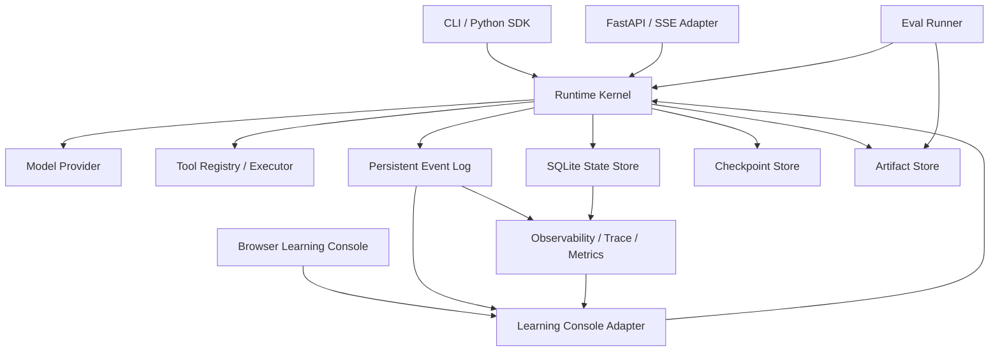
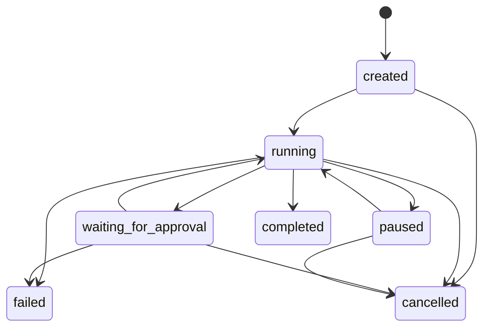

# Agent Runtime 当前架构

> 最近更新：2026-08-14
> 关联记录：[E2026-08-14-006](./CHANGELOG.md#e2026-08-14-006)
> 关联决策：[ADR-0009](./adr/0009-learning-console.md)、[ADR-0008](./adr/0008-observability-evals.md)、[ADR-0007](./adr/0007-model-token-streaming.md)、[ADR-0006](./adr/0006-fastapi-sse-adapter.md)、[ADR-0005](./adr/0005-tool-execution-idempotency.md)、[ADR-0001](./adr/0001-runtime-kernel.md)、[ADR-0002](./adr/0002-model-provider-protocol.md)、[ADR-0003](./adr/0003-sqlite-event-checkpoint.md)、[ADR-0004](./adr/0004-tool-security-boundary.md)

## 1. 系统目标和边界

当前系统是一个面向开发者的、可持久化的单 Agent Runtime。它负责将用户输入转化为受控的模型与工具执行循环，并保留运行状态、事件和 Checkpoint。

当前架构优先保证：接口可替换、执行有界、状态可观察、失败可收敛、人工可介入。它不是分布式调度平台，也不是不可信代码沙箱。

## 2. 总体架构



核心依赖方向由入口指向 Runtime，再由 Runtime 依赖抽象化的 Provider、Tool 和 Store；模型厂商响应和具体工具实现不进入 Runtime Kernel 的领域模型。

## 3. Runtime Kernel

`Runtime` 负责：

- 注册 `AgentDefinition`。
- 创建、启动、等待和恢复 `AgentRun`，并为每个 Run 注入稳定 `trace_id`。
- 执行有最大步数和最大工具调用数的 Agent 循环。
- 将模型响应规范化为文本或 `ToolCall`。
- 触发工具执行、人工审批和 Checkpoint。
- 将完成、失败、暂停和取消收敛为明确 Run 状态。
- 将关键动作写入持久化 Event Log。

公开入口包括 `run()`、`start()`、`wait()`、`stream()`、`pause()`、`resume()`、`cancel()` 和 `resolve_approval()`。

## 4. Run 状态机



非法状态迁移由领域模型拒绝。`completed`、`failed` 和 `cancelled` 是终态。

## 5. Model Provider 层

`ModelProvider` 协议接收统一的 `Message`、`ToolDefinition` 和 `ModelConfig`，返回 `ModelResponse`。Runtime 只理解：

- 文本内容。
- 结构化工具调用。
- finish reason。
- token usage。

当前实现：

- `MockProvider`：确定性测试和本地 Demo。
- `OpenAICompatibleProvider`：通过标准库 HTTP 客户端调用 Chat Completions 兼容端点。

Provider 调用由 Runtime 统一处理超时和指数退避重试。实现 `StreamingModelProvider` 的 Provider 可以输出 `ModelTokenDelta`；Runtime 在不改变既有 Run / Step / ToolExecution / Checkpoint 语义的前提下，将增量写入 `model.delta` 事件，并在模型步骤结束时合并为完整 `ModelResponse`。不支持 `stream()` 的 Provider 自动回退到 `complete()`。

## 6. Tool Executor

工具由 `ToolDefinition`、handler 和超时组成，通过 `ToolRegistry` 注册。执行前进行基础 JSON-schema 风格校验，执行结果统一转换为 `ToolResult`。

当前支持：

- 同步和异步 Python handler。
- required、type、enum 和 additionalProperties 校验。
- 单工具超时。
- 工具异常标准化并回传给模型。
- `requires_approval` 人工审批标记。
- `side_effecting` 副作用标记。
- `CancellationToken` 协作式取消和稳定的 `idempotency_key`。

## 7. SQLite、Step、ToolExecution、Checkpoint 和 Artifact Store

`SQLiteStore` 当前保存：

```text
schema_migrations
runs
events
checkpoints
approvals
steps
tool_executions
```

数据库启用 WAL 和 foreign keys，并通过编号 migration 初始化和升级 schema。`Step` 表示一次模型决策，`ToolExecution` 表示该决策内有序的工具调用。

ToolExecution 保存参数、状态、结果、错误、审批关系、side-effect 标记和 idempotency key。工具完成状态、Run 计数、Checkpoint 和对应 Event 可以在同一 SQLite 事务中提交，降低半状态风险。

Checkpoint 保存恢复所需的消息历史、模型步骤和工具调用计数。`ArtifactStore` 将大文本产物写入按 Run 隔离的目录，但通用大结果自动转存尚未接入执行循环。

## 8. Event Log

每个 Run 的事件使用从 1 开始的单调递增 `sequence`。当前事件覆盖：

```text
run.created / started / recovered / paused / completed / failed / cancelled
model.requested / stream.started / delta / stream.completed / stream.failed / completed
tool.requested / started / completed / failed / rejected / cancelled / outcome_unknown / unknown_resolved
checkpoint.created
approval.requested / resolved
step.completed
```

`Runtime.stream()` 轮询 SQLite 中的新事件并按 sequence 输出。Provider 层的 `ModelTokenDelta` 是短生命周期增量；Runtime 将它映射为可审计的 `model.delta` 事件。最终 assistant message、Tool Call 和工具结果仍通过 Step / Checkpoint 持久化。该接口为 SSE、WebSocket 或消息队列适配保留稳定消费边界。

## 9. API、SDK 与 CLI

Python SDK 暴露 Runtime 和领域对象，并提供本地 Demo runtime 构造函数。

CLI 当前支持：

```text
agent-runtime lab
agent-runtime demo
agent-runtime runs list
agent-runtime runs get
agent-runtime runs events
agent-runtime runs pause
agent-runtime runs resume
agent-runtime runs cancel
agent-runtime approve
agent-runtime resolve-unknown
agent-runtime observe metrics
agent-runtime observe trace <run-id>
agent-runtime eval demo
```

核心 Runtime 不依赖 CLI 或 HTTP 框架。

## 9.1 FastAPI Run API 与 SSE

FastAPI 位于 Application / Adapter Layer，只调用 Runtime、SQLiteStore 和 Runtime.stream()，不直接实现模型循环、工具执行或 SQLite 连接操作。

- `POST /runs` 创建并异步启动 Run，返回 `202 Accepted`。
- `GET /runs/{run_id}` 查询持久化 Run 状态。
- `GET /runs/{run_id}/events` 读取按 sequence 排序的历史事件。
- `GET /runs/{run_id}/events/stream?after_sequence=N` 通过 SSE 轮询 `Runtime.stream()`，使用 Event sequence 作为 SSE id，支持断点续传。
- `POST /runs/{run_id}/pause|resume|cancel` 复用 Runtime 生命周期控制。
- `GET /runs/{run_id}/approvals/pending` 与 `POST /approvals/{approval_id}/resolve` 完成人工审批。

v0.4 起，SSE 仍然只有一个事件流协议；客户端根据 `type` 区分 `model.delta`、`tool.completed` 等事件。`model.delta` 是持久化 Runtime Event，因此支持 `after_sequence` 断点续传；Provider 不支持 streaming 时，Runtime 会回退为一次性的完整响应事件。

## 9.2 Observability、Trace 与 Metrics

`ObservabilityService` 不侵入 Runtime 状态机，而是从 `SQLiteStore` 中已经持久化的 Run 和 Runtime Event 派生观测结果：

- `RunTrace`：包含一个 Run root span，以及 Model、Tool、Approval 子 span。
- `MetricsSnapshot`：包含 Run 状态分布、事件计数、模型/工具/审批次数、token usage、平均延迟和 p95 Run 延迟。
- Prometheus 文本：通过固定 `agent_runtime_*` 指标名称导出。

每个新 Run 的 metadata 自动包含 `trace_id`。Trace Span 使用事件 sequence 和 timestamp 构造，因此可以回溯到原始事件，但当前没有修改 SQLite Event schema，也没有依赖 OpenTelemetry SDK。

FastAPI 暴露：

- `GET /observability/metrics`。
- `GET /observability/metrics/prometheus`。
- `GET /runs/{run_id}/trace`。

## 9.3 Eval Runner

`EvalRunner` 使用与生产执行相同的 Runtime 路径逐个运行 `EvalCase`，不会绕过 Provider、Tool、Checkpoint 或 Event Log。每个 Eval Run 的 metadata 保存 `eval_report_id`、`eval_suite` 和 `eval_case`，因此评估结果可以反查完整 Trace 和事件。

当前内置评估器：

- `ExpectedStatusEvaluator`：检查 Run 最终状态。
- `ExactMatchEvaluator`：检查最终文本精确匹配。
- `ContainsEvaluator`：检查最终文本包含指定片段。

`EvalReport` 汇总用例级断言、通过率、Run ID、Trace ID 和耗时，并写入 Artifact Store 的 `eval-report.json`。当前顺序执行以保证确定性，尚未实现并发评估、统计显著性或 LLM-as-a-Judge。

## 9.4 Learning Console

Learning Console 是 `agent_runtime.lab` 中的教学 Adapter，通过 `create_app(..., enable_learning_console=True)` 挂载到 `/lab`。默认 `create_demo_app()` 和 `agent-runtime lab` 会启用该 Adapter。

组成：

- `ScenarioRegistry`：保存场景默认输入、预期事件、学习点、人工动作提示和验收条件。
- 场景 Runtime：为纯文本、Tool Calling、Token Streaming 和 Human Approval 配置确定性 Provider、ToolRegistry 和 AgentDefinition。
- `LearningConsole`：启动场景 Run，根据 `learning_scenario` metadata 定位恢复所需的 Runtime，并聚合 Snapshot。
- Lab FastAPI Routes：提供场景目录、启动、Snapshot 和审批接口。
- Static UI：将事件按 Run / Model / Tool / Approval / State 泳道排布，用 sequence 列、相对时间和 SVG 曲线表达执行跳转，并展示回放、状态 diff、Messages、ToolExecution、Trace、Metrics、SQLite 和验收结果。

所有场景 Runtime 共享现有 SQLiteStore，但不共享 Provider 行为。Run、Event、Step、ToolExecution、Approval 和 Checkpoint 仍是唯一执行事实；教学解释和状态投影只用于展示，不回写领域状态。

Snapshot 使用 `SQLiteStore.steps_for_run()` 和 `tool_executions_for_run()` 读取持久化执行记录，并通过 `ObservabilityService` 派生 Trace/Metrics。事件实时通知复用既有 `/runs/{run_id}/events/stream`，没有新增第二套流协议。

泳道图是纯前端投影：`eventLane()` 仅根据 Event type 选择泳道，`RuntimeEvent.sequence` 决定水平顺序，timestamp 只用于计算相对时间。SVG 连线、自动滚动和播放状态都不回写 Store。

空状态仅在 Snapshot 没有 Event 时显示。JavaScript 切换 `HTMLElement.hidden`，CSS 显式定义 `.empty-state[hidden] { display: none; }`，避免空状态的 `display: grid` 覆盖浏览器 hidden 默认样式。该适配属于 Static UI，不改变 Snapshot 和 Runtime 语义。

事件“回放”只移动浏览器展示游标。它不会暂停 Runtime asyncio Task，也不会改变 Run 状态机、Event sequence 或恢复语义。该边界保证 Learning Console 可以随功能演进扩展，而 Runtime Kernel 不依赖 UI。

> 最近更新：2026-08-14
> 关联记录：[E2026-08-14-006](./CHANGELOG.md#e2026-08-14-006)
> 关联决策：[ADR-0009](./adr/0009-learning-console.md)

## 10. 安全边界

当前默认安全策略：

- 工具必须显式注册，模型不能构造任意可执行函数。
- 文件路径先 `resolve()`，然后验证仍位于配置的 workspace 内。
- 写文件工具默认要求人工审批。
- 不提供任意 Shell、进程管理或自动依赖安装。
- 工具参数必须通过 schema 校验。
- 模型 API Key 从构造参数或环境变量读取，不写入事件和数据库。

当前是进程级受控执行，不是针对恶意代码的强隔离沙箱。

## 11. 错误处理与恢复语义

- 模型错误：在配置次数内指数退避重试，耗尽后将 Run 标记为 failed。
- 工具错误：转换为工具消息并返回模型，使 Agent 可以重新规划。
- 工具超时：转换为 `ToolExecutionError`。
- Run 超时：执行循环终止并进入 failed。
- 暂停：保存最新 Checkpoint 后返回 paused。
- 审批：保存工具调用和 Checkpoint，批准后执行，拒绝后将拒绝原因作为工具结果返回模型。
- 恢复：加载最新 Checkpoint 和未完成 Step；已完成的 ToolExecution 复用持久化结果，不重复执行。
- 未知副作用：进程在副作用工具运行中重启时标记为 `unknown`，Run 暂停并等待人工确认完成、重试或失败。
- 取消：取消活动 asyncio Task，并通过 ToolContext 向 handler 发出协作式取消信号。

## 12. 当前扩展点

- 新增 `ModelProvider` 实现。
- 注册新的受控工具。
- 将 SQLite repository 替换为其他持久化实现。
- 在事件消费边界上增加 WebSocket、消息队列或 OpenTelemetry Exporter。
- 增加独立 `SandboxExecutor`，而不是让 Runtime 直接执行 Shell。
- 在单 Agent Kernel 之上增加调度与多 Agent 编排层。

## 13. 当前非目标

- 多 Agent DAG 或角色委派。
- 分布式 Worker 和高可用调度。
- 多租户、RBAC 和配额。
- 向量数据库与长期记忆治理。
- 任意代码或 Shell 执行。
- 面向生产的完整 Web 管理控制台（当前仅有本地 Learning Console）。
- 外部 OpenTelemetry Collector、时序数据库和分布式 Trace Backend。
- LLM-as-a-Judge、数据集版本管理和统计显著性分析。
