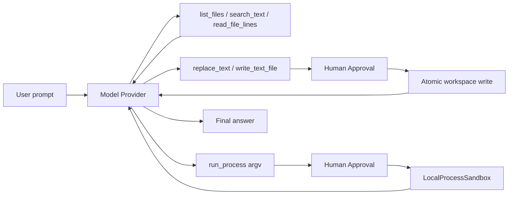

# Coding Workspace Tools 使用指南

- **适用版本**：v0.8.8+
- **最近更新**：2026-08-18
- **关联变更**：[E2026-08-18-001](./CHANGELOG.md#e2026-08-18-001)、[E2026-08-17-003](./CHANGELOG.md#e2026-08-17-003)、[E2026-08-17-002](./CHANGELOG.md#e2026-08-17-002)、[E2026-08-17-001](./CHANGELOG.md#e2026-08-17-001)
- **关联决策**：[ADR-0032](./adr/0032-artifact-paging-workspace-discovery.md)、[ADR-0030](./adr/0030-bounded-read-batch-patch.md)、[ADR-0029](./adr/0029-read-only-git-workspace-tools.md)、[ADR-0028](./adr/0028-coding-workspace-tools.md)

## 1. 目标

v0.8.3 把 Interactive CLI 从“能聊天、能调用少量示例 Tool”推进到“能完成一个受控的本地编码闭环”。标准本地 Agent 现在可以：

1. 列出 Workspace 内的文件。
2. 搜索 UTF-8 文本和代码。
3. 读取目标文件。
4. 通过精确文本替换修改已有文件，或通过 `write_text_file` 创建/覆盖文件。
5. 在人工批准后运行白名单中的本地进程，例如 Python 或 Git。
6. 读取 Tool 结果并向用户汇报。

这些 Tool 仍然走同一套 Runtime、Approval、ToolExecution、Checkpoint、Event Log 和恢复语义，不是 CLI 内部的旁路脚本。



## 2. 最短使用方式

```powershell
cd D:\AICoding\Agent
.\.venv\Scripts\Activate.ps1
agent-runtime chat
```

可以直接输入：

```text
请列出 src/agent_runtime 下的 Python 文件，找到 Runtime 类的定义位置并总结它的职责。
```

修改并验证示例：

```text
请读取 examples 目录，选择一个最小示例补充清晰注释，然后运行 Python 做语法检查。修改文件和执行进程前先让我确认。
```

模型是否调用 Tool 取决于模型本身的 Tool Calling 能力。真实模型必须支持 OpenAI-compatible Tool Call 协议。

## 3. Tool 说明

### `list_files`

列出 Workspace 内文件，返回排序后的相对路径。

```json
{
  "path": "src",
  "pattern": "*.py",
  "recursive": true,
  "max_results": 200
}
```

默认跳过：

```text
.git
.venv
.agent-runtime
__pycache__
.pytest_cache
.mypy_cache
.ruff_cache
.runtime-test-data
.tox
dist
node_modules
.coverage
coverage.json
```

结果数量和扫描数量都有硬上限，避免把大型目录无界注入模型上下文。如果结果显示 `truncated`，应缩小 `path`/`pattern` 或改用 `search_text` 继续，而不是直接结束任务。

### `search_text`

在 UTF-8 文本文件中搜索内容，返回 `path`、`line` 和截断后的匹配行。

```json
{
  "query": "class Runtime",
  "path": "src",
  "glob": "*.py",
  "case_sensitive": true,
  "max_results": 100
}
```

它使用纯 Python 实现，不依赖本机安装 `ripgrep`。二进制文件、无效 UTF-8 文件和超过单文件上限的文件会被跳过。

### `read_text_file`

读取 Workspace 内一个 UTF-8 源码或文档文件。路径 resolve 后如果逃逸 Workspace，会立即拒绝。若路径属于当前 Run 的 Tool Result Artifact，会明确提示改用 `read_artifact`，防止大结果递归 Artifact 化。

```json
{
  "path": "README.md"
}
```

### `read_artifact`

分页读取 Runtime 返回的 Tool Result Artifact，不需要进程审批，也不能读取其他 Run 或任意 Artifact：

```json
{
  "path": "run_xxx/tool-results/tool_xxx.txt",
  "offset": 0,
  "max_chars": 3000
}
```

返回字段：

- `content`：本页正文。
- `next_offset`：下一页字符偏移。
- `total_chars`：Artifact 总字符数。
- `has_more`：是否需要继续读取。
- `sha256`：完整 Artifact 的内容摘要。

`max_chars` 范围是 256–4000。只要 `has_more=true`，继续使用 `next_offset`。不要通过 Python、`cat`、`type` 或 `run_process` 打印 Artifact；`read_artifact` 页面不会再次触发 Artifact 化。

### `replace_text`

在已有 UTF-8 文件中执行精确替换。

```json
{
  "path": "src/example.py",
  "old_text": "value = 1",
  "new_text": "value = 2",
  "expected_replacements": 1
}
```

规则：

- `old_text` 不能为空。
- 实际匹配数必须等于 `expected_replacements`，默认是 1。
- 0 次匹配或意外多次匹配时不写文件。
- 不负责解析 unified diff。
- 不创建新文件；创建文件继续使用 `write_text_file`。
- 写入采用同目录临时文件、flush/fsync 和 `os.replace`。
- 成功结果包含修改前后 SHA-256，便于 `/diff` 展示和审计。
- 具有 `file.write` capability，必须人工批准。

### `write_text_file`

创建或完整覆盖 UTF-8 文件，属于副作用 Tool，必须人工批准。对于修改已有文件，优先使用 `replace_text`，因为它能验证旧内容和匹配次数，误改风险更低。

### `run_process`

在 `LocalProcessSandbox` 中按 argv 启动白名单可执行文件，不经过 Shell。

```json
{
  "argv": ["python", "-m", "pytest", "tests/test_example.py", "-q"],
  "cwd": ".",
  "timeout_seconds": 120
}
```

它具有 `process.exec`、`file.read` 和 `file.write` capability，默认必须人工批准。当前 Sandbox 负责白名单、Workspace cwd、环境变量、超时、输出上限、并发上限和进程树取消，但不是容器或虚拟机。

## 4. 本地配置

新生成的 `agent-runtime.toml` 包含：

```toml
[tools]
sync_workers = 8
pending_queue_size = 32
enable_process = true
allowed_executables = ["python", "git"]
process_timeout_seconds = 120
process_max_output_bytes = 1000000
process_max_concurrent = 2
```

旧配置没有这些字段时会使用同样的默认值，因此不要求重建配置。

如不希望模型执行任何本地进程：

```toml
[tools]
enable_process = false
```

如果只允许当前 Python，可以把 `allowed_executables` 改为 Python 可执行文件的绝对路径。Runtime 启动时会解析白名单；无法解析的可执行文件会导致启动失败，而不是静默放宽策略。

## 5. Interactive CLI 辅助命令

```text
/tools       查看 Tool、capability、审批和副作用属性
/workspace   查看 Workspace、State、Coding Tool 和进程执行状态
/diff        查看当前 Session 最近 20 条文件写入/替换摘要
/events      查看最近 Run 的 durable Event
```

`/diff` 不是 Git diff 引擎。它读取 SQLite 中的 `ToolExecution.result_data`，展示由 `replace_text` 和 `write_text_file` 产生的最近变更摘要；它不会扫描用户在 Runtime 外手动修改的文件。

## 6. 处理流程与可追溯性

每次 Tool Call 都经历：

```text
model tool call
→ tool.policy.evaluated
→ approval.requested（需要时）
→ tool.requested
→ tool.started
→ tool.completed / tool.failed / tool.outcome_unknown
→ checkpoint
→ 下一次 model request
```

文件修改和进程执行都属于副作用操作。批准只针对当前持久化 Approval；Runtime 不会因为一次批准而永久自动批准后续命令。

## 7. 当前边界

v0.8.3 明确不提供：

- 完整 unified diff / patch parser。
- Git 自动 commit 或自动 push。
- 自动安装依赖。
- Shell 字符串、管道、重定向或交互式 PTY。
- LSP、代码索引服务或语义级重构。
- 多 Workspace。
- 自动批准文件写入或进程执行。
- 容器级不可信代码强隔离。
- 无限制自主循环。

当前最重要的目标是让一个本地用户能够看懂、批准和恢复真实编码 Tool Loop，而不是复制完整 Claude Code 或 Codex 功能集。
## 11. v0.8.4 Git-aware Workspace Review

当 Git 位于 `[tools].allowed_executables` 时，标准本地 Agent 自动增加：

- `git_status`：读取 branch、tracked change 和 untracked 状态。
- `git_diff`：读取 staged 或 unstaged tracked diff，支持路径、context line 和最大字符数。

两个 Tool 都通过 LocalProcessSandbox 执行，不经过 Shell，不需要 Approval，也不提供任何 Git 写操作。`git_diff` 不包含 untracked 文件正文。

## 12. v0.8.5 有界读取与批量 Patch

`read_file_lines` 使用 `start_line`、`max_lines` 和 `max_chars` 控制进入模型上下文的文件范围，默认 3000、最大 3500 字符，并返回总行数、`next_start_line`、`has_more` 和 SHA-256。

`apply_patch` 接受最多 20 条 `{path, old_text, new_text, expected_replacements}` edit。所有 edit 在写文件前统一校验；成功后返回每个文件的 replacement count 和前后 SHA-256。它需要 Approval，不是 unified diff parser，也不承诺跨进程崩溃的多文件事务原子性。

## 13. v0.8.6 Project-aware context

The standard local Agent composes its built-in coding protocol with bounded root-level `AGENTS.md` and `CLAUDE.md` instructions. It requires inspection, diff review, and focused validation without bypassing Tool Approval. `/workspace` and `agent-runtime status` expose source summaries only.


## 14. v0.8.7 Artifact-aware Reading 与 Discovery

大 Tool Result 使用 `read_artifact` 按页续读；文件发现默认过滤 Runtime/coverage 产物。内建协议要求在目标可推断时继续执行，在广泛列表截断时缩小范围，不因一次截断就反问用户或结束 Run。

## 15. v0.8.8 Verified Task Completion

标准本地 Runtime 注入 `CodingCompletionPolicy`，普通 SDK Runtime 默认不启用。Policy 不新增写入或执行能力，只从当前 Run 的 ToolExecution 判断：

- 是否成功写入文件。
- 修改了哪些文件。
- 最后一次写入后是否调用 `git_diff`。
- 代码文件修改后是否调用 pytest、ruff、mypy、unittest 或常见语言 test/check/lint 命令。
- 验证进程的真实 exit code 是否为零。

第一次最终回答缺少证据时，Runtime 持久化 `completion.verification_requested` 并继续一个 Model Step；不会自动批准、自动运行命令或无限循环。最终 `completion.evidence` 的 `status` 为：

- `read_only`：本轮没有成功文件写入。
- `verified`：当前可用门禁均有成功证据。
- `unverified`：提醒后仍缺 diff 或验证证据。

当前识别是保守 allowlist。项目自定义命令如果不能被识别，仍可执行，但不会被自动计入 validation evidence；模型应在最终回答中准确说明实际执行结果。
