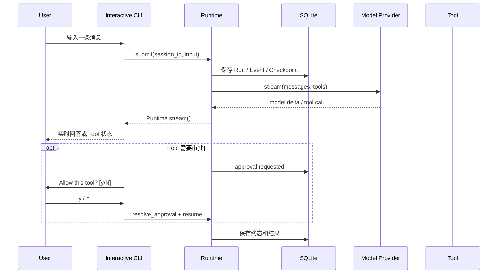

# Interactive CLI 使用指南

- **适用版本**：v0.8.8+
- **最近更新**：2026-08-18
- **关联变更**：[E2026-08-18-001](./CHANGELOG.md#e2026-08-18-001)、[E2026-08-17-001](./CHANGELOG.md#e2026-08-17-001)、[E2026-08-16-006](./CHANGELOG.md#e2026-08-16-006)
- **关联决策**：[ADR-0032](./adr/0032-artifact-paging-workspace-discovery.md)、[ADR-0028](./adr/0028-coding-workspace-tools.md)、[ADR-0027](./adr/0027-interactive-cli-session-history.md)

## 1. 它解决什么问题

`agent-runtime chat` 是面向本地用户的终端 Agent Shell。它复用真实 Runtime Kernel、SQLite、Model Provider、Tool Registry、Approval、Checkpoint 和 Event Log，不是绕过 Runtime 的聊天 Demo。

一次交互由两个层次组成：

- **Session**：一段可跨进程恢复的对话。
- **Run**：用户每发送一条消息，就创建一个新的持久化 Run。



## 2. 安装与初始化

```powershell
cd D:\AICoding\Agent
.\.venv\Scripts\Activate.ps1
python -m pip install -e ".[api]"
agent-runtime init
```

如果已经存在 `agent-runtime.toml`，不需要重复初始化。配置中的 `api_key_env` 必须填写环境变量名称，而不是 API Key 明文。

真实 OpenAI-compatible Provider 示例：

```toml
[model]
provider = "openai-compatible"
model = "your-model"
base_url = "https://api.openai.com/v1"
api_key_env = "OPENAI_API_KEY"
```

```powershell
$env:OPENAI_API_KEY = "..."
```

## 3. 开始对话

```powershell
agent-runtime chat
```

启动后会显示 Workspace、Agent、Provider、Model 和 Session ID。直接输入问题并回车：

```text
You > 请先读取 README.md，再用三点总结这个项目
```

模型的 `model.delta` 会边生成边显示；如果模型调用 Tool，终端会显示 Tool 名称、参数、运行状态和结果摘要。

### 单次执行

```powershell
agent-runtime chat -p "19 * 23" --no-color
```

`--print` 只执行一轮并退出，适合脚本、smoke test 或把结果传给其他命令。返回码语义：

- `0`：Run completed。
- `1`：Run 进入 failed/cancelled 等非完成终态。
- `2`：参数、配置或启动失败。

## 4. Session 与多轮上下文

新启动默认创建新的 Interactive CLI Session：

```powershell
agent-runtime chat
```

继续最近会话：

```powershell
agent-runtime chat -c
```

恢复指定会话：

```powershell
agent-runtime chat -r <session_id>
```

Shell 内也可以使用 `/new`、`/sessions` 和 `/resume <session_id>`。

Interactive CLI 每轮会显式请求 Session 历史。Runtime 只加载：

1. 同一个 Session。
2. 同一个 Agent。
3. 状态为 `completed` 且存在 final result 的历史 Run。
4. 每个历史 Run 的 user input 与 final assistant result。
5. 默认最近 20 个 Run，硬上限 100。

它不会回放旧 Tool Call、Tool Result、Approval、Checkpoint 或内部 Event。每次装配历史会写入 `session.history.loaded` durable Event，便于观察实际加载数量。

终端输入历史保存在：

```text
<state_dir>/cli-history
```

它只用于方向键和输入建议，不是 Runtime Session，也不能作为恢复或审计事实。

## 5. Slash Command

| 命令 | 作用 |
| --- | --- |
| `/help` | 显示帮助和快捷键 |
| `/new` | 创建并切换到新 Session |
| `/continue` | 切换到最近一次 Interactive CLI Session |
| `/sessions` | 列出最近 Session、更新时间和 Run 数 |
| `/resume <session_id>` | 切换到指定持久化 Session |
| `/status` | 显示 Workspace、State、Agent、Provider、Model、Session 和 Run |
| `/model` | 显示当前 Provider 与 Model |
| `/tools` | 显示当前 Agent 可用 Tool、capability、审批和副作用属性 |
| `/workspace` | 显示 Workspace、State、Coding Tool、进程开关和写入策略 |
| `/diff` | 显示当前 Session 最近的 Tool 文件写入/替换摘要 |
| `/events` | 显示本 Shell 最近 Run 的 Event sequence、类型和时间 |
| `/cancel` | 请求取消活动 Run |
| `/clear` | 清空终端显示，不删除历史数据 |
| `/quit`、`/exit` | 退出 Shell |

## 5.1 Coding Tool Loop

v0.8.7 的标准本地 Runtime 会在 Banner 和 `/tools` 中显示 Coding Tool。可以让模型按“发现 → 搜索 → 读取 → 修改 → 验证 → 汇报”完成真实 Workspace 任务：

```text
You > 请找到 examples 中最小的 Python 示例，补充一条注释，然后运行 Python 做语法检查。
```

`replace_text`、`apply_patch`、`write_text_file` 和 `run_process` 都会停在 Approval；批准后继续原 Run，不创建旁路任务。`/diff` 从 SQLite ToolExecution 中读取最近变更摘要，不是 Git diff，也不会显示 Runtime 外的手工修改。大 Tool Result 出现 Artifact 提示时，模型可直接调用 `read_artifact` 按 `next_offset` 续读，不会触发新的 Approval 或递归 Artifact。根目录列表截断时会继续缩小范围或搜索已知符号。完整 Tool 协议见 [CODING_TOOLS.md](./CODING_TOOLS.md)。

## 5.2 Project-aware Workspace Context

At startup the Runtime loads root-level `AGENTS.md` and `CLAUDE.md` under a shared 50000-character budget. Banner shows loaded files and `/workspace` shows SHA-256 and truncation. Content is stored only in the AgentDefinition snapshot and requires Shell restart to refresh.

## 5.3 Verified Task Completion

v0.8.8 的标准本地 Runtime 会区分“模型声明完成”和“Tool 证据支持完成”。只读问答不增加步骤；当本轮成功调用 `write_text_file`、`replace_text` 或 `apply_patch` 后，Runtime 检查最后一次写入之后是否读取 Git diff，以及代码文件是否运行了可识别的最窄验证命令。

证据不足时终端会显示：

```text
↻ Runtime is verifying changes before completion: post-change Git diff was not inspected; no post-change validation command was run
```

Runtime 只提醒一次。最终会显示：

```text
✓ Completion evidence: verified · 2 file(s) · diff inspected · validation passed
```

或者：

```text
! Completion evidence: unverified · 1 file(s) · diff not inspected · validation not run
```

`unverified` 不表示写入一定失败，只表示当前 Run 没有足够持久化证据支持“已经检查并验证”的结论。用户明确跳过测试、项目没有测试或验证工具不可用时，模型应在最终回答中说明未验证项。

## 6. Tool Approval

当 ToolDefinition 设置 `requires_approval=True` 时，Runtime 会先持久化 Approval 并暂停 Run。终端显示：

```text
Allow this tool? [y/N]
```

- 输入 `y` 或 `yes`：批准，恢复原 Run。
- 输入 `n`、`no` 或直接回车：拒绝，恢复原 Run 并把拒绝结果交回模型。
- `Ctrl+C` 或 `Ctrl+D`：按拒绝处理。

审批决定仍由 Runtime 持久化，不只存在于终端输出中。

## 7. 取消与退出

- **模型或 Tool 正在运行时按 `Ctrl+C`**：调用 `runtime.cancel(run_id)`，等待当前 Run 收敛后返回 `You >`。
- **正在输入提示时按 `Ctrl+C`**：清空当前输入，不退出 Shell。
- **按 `Ctrl+D`**：退出 Shell。
- **输入 `/quit` 或 `/exit`**：退出 Shell。

同步副作用 Tool 已经开始后无法安全强杀；如果取消时无法确认结果，Runtime 仍按已有可靠性语义进入 `UNKNOWN`，不会伪装成安全取消。

## 8. Owner Lock 与 `serve`

`chat` 采用 embedded Runtime 模式，会获取状态目录的 `runtime.lock`。它与 `serve` 都可能执行 Run，因此同一状态目录只能有一个 Owner：

```text
agent-runtime chat   ─┐
                     ├─ 同一 state_dir 下二选一
agent-runtime serve  ─┘
```

如果 `serve` 已经运行，先在服务窗口按 `Ctrl+C`，再启动 `chat`。也可以显式使用另一个状态目录，但两个状态目录的 Session、Run 和 Event 不共享：

```powershell
agent-runtime --state-dir .agent-runtime-chat chat
```

v0.8.2 不支持让 CLI attach 到已运行的 HTTP daemon；如果真实使用证明这是高频痛点，再单独设计 HTTP Client 模式。

## 9. 理解终端里看到的内容

| 终端内容 | Runtime 事实 |
| --- | --- |
| `Assistant >` 后逐字出现 | 持久化 `model.delta` Event |
| `Tool <name>` | `tool.requested` Event |
| `running <name>` | `tool.started` Event |
| `<name> completed` | `tool.completed` Event |
| `Approval required` | `approval.requested` 与 Approval 记录 |
| Run 摘要 | 最终 AgentRun 的 step/tool 计数 |
| `/events` 表格 | SQLite durable Event Log |

默认不会把 `context.built`、Checkpoint 等内部事件铺满终端；需要完整教学视图时使用 `agent-runtime lab`，需要原始事件时使用 `/events` 或正式 API。

## 10. 快速验收

离线 Mock 验收：

```powershell
agent-runtime chat -p "19 * 23" --no-color
```

预期包含：

```text
437
```

交互验收：

```powershell
agent-runtime chat
```

依次尝试：

```text
/status
/tools
19 * 23
/events
/new
/sessions
/quit
```

开发者回归：

```powershell
python -m pytest tests/test_interactive.py -q -p no:cacheprovider
python scripts/check_docs.py
```

## 11. 当前限制

- 当前是 embedded Runtime，不是远程 daemon Client。
- Session 历史只重建 user/final assistant，不包含旧 Tool 中间消息。
- 默认历史窗口按 Run 数限制，不按模型 token 精确裁剪；进入模型前仍由现有 ContextBuilder 处理总预算。
- `/events` 只显示当前 Shell 最近提交的 Run。
- 终端展示是 Adapter 投影；SQLite Run、Event、Checkpoint、Approval 和 ToolExecution 才是执行事实。
