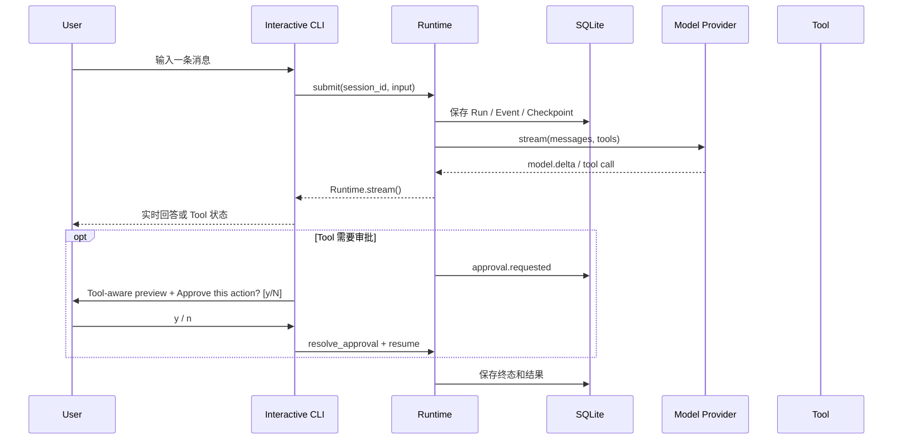

# Interactive CLI 使用指南

- **适用版本**：v0.8.18+
- **最近更新**：2026-08-19
- **关联变更**：[E2026-08-19-010](./CHANGELOG.md#e2026-08-19-010)、[E2026-08-19-009](./CHANGELOG.md#e2026-08-19-009)、[E2026-08-19-008](./CHANGELOG.md#e2026-08-19-008)、[E2026-08-19-006](./CHANGELOG.md#e2026-08-19-006)、[E2026-08-19-005](./CHANGELOG.md#e2026-08-19-005)、[E2026-08-19-004](./CHANGELOG.md#e2026-08-19-004)、[E2026-08-19-003](./CHANGELOG.md#e2026-08-19-003)、[E2026-08-19-002](./CHANGELOG.md#e2026-08-19-002)、[E2026-08-19-001](./CHANGELOG.md#e2026-08-19-001)、[E2026-08-18-003](./CHANGELOG.md#e2026-08-18-003)、[E2026-08-18-001](./CHANGELOG.md#e2026-08-18-001)、[E2026-08-17-001](./CHANGELOG.md#e2026-08-17-001)、[E2026-08-16-006](./CHANGELOG.md#e2026-08-16-006)
- **关联决策**：[ADR-0041](./adr/0041-fresh-finalization-context.md)、[ADR-0039](./adr/0039-textual-tool-call-guard.md)、[ADR-0038](./adr/0038-finalization-context-integrity.md)、[ADR-0037](./adr/0037-evidence-aware-convergence.md)、[ADR-0036](./adr/0036-read-only-tool-convergence.md)、[ADR-0035](./adr/0035-interactive-cli-execution-transparency.md)、[ADR-0034](./adr/0034-interactive-cli-presentation.md)、[ADR-0032](./adr/0032-artifact-paging-workspace-discovery.md)、[ADR-0028](./adr/0028-coding-workspace-tools.md)、[ADR-0027](./adr/0027-interactive-cli-session-history.md)

## 1. 它解决什么问题

`agent-runtime chat` 是面向本地用户的终端 Agent Shell。它复用真实 Runtime Kernel、SQLite、Model Provider、Tool Registry、Approval、Checkpoint 和 Event Log，不是绕过 Runtime 的聊天 Demo。

一次交互由两个层次组成：

- **Session**：一段可跨进程恢复的对话。
- **Run**：用户每发送一条消息，就创建一个新的持久化 Run。



## 2. 安装与初始化

```powershell
cd D:\AICoding\Agent
.\.venv\Scripts\Activate.ps1
python -m pip install -e ".[api]"
agent-runtime init
```

如果已经存在 `agent-runtime.toml`，不需要重复初始化。配置中的 `api_key_env` 必须填写环境变量名称，而不是 API Key 明文。

真实 OpenAI-compatible Provider 示例：

```toml
[model]
provider = "openai-compatible"
model = "your-model"
base_url = "https://api.openai.com/v1"
api_key_env = "OPENAI_API_KEY"
```

```powershell
$env:OPENAI_API_KEY = "..."
```

## 3. 开始对话

```powershell
agent-runtime chat
```

启动后会显示 Workspace、Agent、Provider、Model 和 Session ID。直接输入问题并回车：

```text
You > 请先读取 README.md，再用三点总结这个项目
```

模型的 `model.delta` 会先合并成当前 Markdown 内容段，并在空行或代码围栏闭合后将稳定 Markdown 块追加显示一次；未完成尾部会继续缓冲到下一个边界，因此不会因终端光标重绘兼容性产生重复帧。Tool 默认只显示名称和紧凑摘要；常见只读 inspection Tool 在 compact 模式隐藏 requested 行，只保留 completed、failed 或 reused 结果，避免同一次调用占两行。需要完整有界参数和多行结果时使用 `--verbose` 或 `/display verbose`。

### 单次执行

```powershell
agent-runtime chat -p "19 * 23" --no-color
```

`--print` 只执行一轮并退出，只输出最终 `AgentRun.result`，不会混入 streaming delta、Tool 状态或 Run 摘要，适合脚本、smoke test 或把结果传给其他命令。返回码语义：

- `0`：Run completed。
- `1`：Run 进入 failed/cancelled 等非完成终态。
- `2`：参数、配置或启动失败。

## 4. Session 与多轮上下文

新启动默认创建新的 Interactive CLI Session：

```powershell
agent-runtime chat
```

继续最近会话：

```powershell
agent-runtime chat -c
```

恢复指定会话：

```powershell
agent-runtime chat -r <session_id>
```

Shell 内也可以使用 `/new`、`/sessions` 和 `/resume <session_id>`。

Interactive CLI 每轮会显式请求 Session 历史。Runtime 只加载：

1. 同一个 Session。
2. 同一个 Agent。
3. 状态为 `completed` 且存在 final result 的历史 Run。
4. 每个历史 Run 的 user input 与 final assistant result。
5. 默认最近 20 个 Run，硬上限 100。

它不会回放旧 Tool Call、Tool Result、Approval、Checkpoint 或内部 Event。每次装配历史会写入 `session.history.loaded` durable Event，便于观察实际加载数量。

终端输入历史保存在：

```text
<state_dir>/cli-history
```

它只用于方向键和输入建议，不是 Runtime Session，也不能作为恢复或审计事实。

## 5. Slash Command

| 命令 | 作用 |
| --- | --- |
| `/help` | 显示帮助和快捷键 |
| `/new` | 创建并切换到新 Session |
| `/continue` | 切换到最近一次 Interactive CLI Session |
| `/sessions` | 列出最近 Session、更新时间和 Run 数 |
| `/resume <session_id>` | 切换到指定持久化 Session |
| `/status` | 显示 Workspace、State、Agent、Provider、Model、Session 和 Run |
| `/model` | 显示当前 Provider 与 Model |
| `/display [compact|verbose]` | 查看或切换当前 Shell 的 Tool 展示模式 |
| `/tools` | 显示当前 Agent 可用 Tool、capability、审批和副作用属性 |
| `/workspace` | 显示 Workspace、State、Coding Tool、进程开关和写入策略 |
| `/diff` | 显示当前 Session 最近的 Tool 文件写入/替换摘要 |
| `/events` | 显示本 Shell 最近 Run 的 Event sequence、类型和时间 |
| `/cancel` | 请求取消活动 Run |
| `/clear` | 清空终端显示，不删除历史数据 |
| `/quit`、`/exit` | 退出 Shell |

## 5.1 Streaming Markdown 与显示模式

默认模式是 `compact`：

```powershell
agent-runtime chat
agent-runtime chat --compact
```

Compact 只显示 Tool 名称和单行摘要。例如：

```text
● read_file_lines  src/agent_runtime/runtime.py:1500+120
✓ read_file_lines  120 line(s); next_start_line=1620
● run_process  python -m pytest tests/test_interactive.py
✓ run_process  exit_code=0
```

切换诊断视图：

```powershell
agent-runtime chat --verbose
```

或在 Shell 内：

```text
/display verbose
/display compact
```

Verbose 会用有界 Panel/Syntax 展示 Tool JSON 参数、多行结果和失败详情，单块最多 4000 字符。Display mode 仅影响当前终端投影，不修改 SQLite Event、ToolExecution、Session 或 Run；重启 Shell 后恢复默认 compact。

连续 `model.delta` 会组成一个 Assistant Markdown Buffer。Renderer 在空行或 fenced code block 闭合时只追加一次稳定 Markdown 块，未完成尾部继续保留；Tool、Approval、完成证据或终态会结束当前内容段并刷新剩余 Markdown。TTY、`--no-color` 和重定向输出遵循同一 append-only 规则，不依赖 ANSI 光标回退。

## 5.2 Execution Phases

v0.8.10 根据 durable Tool Event 在终端派生执行阶段，并且只在阶段发生变化时 append：

```text
● Inspecting workspace
✓ read_file_lines  README.md:1+200
● Editing workspace
✓ apply_patch  2 edit(s) · src/example.py, tests/test_example.py
● Verifying changes
✓ git_diff  all tracked files
✓ run_process  python -m pytest tests/test_example.py -q
```

文件发现、搜索和读取进入 Inspecting；写入、精确替换和批量 Patch 进入 Editing；Git diff 及已识别测试/静态检查命令进入 Verifying；其他 Tool 使用 `Executing action`。v0.8.12 让 Completion Policy 与 Renderer 共用同一个 classifier，并将 `python scripts/check_docs.py`、`check_coverage.py`、`verify_distribution.py`、`verify_local_runtime.py` 识别为验证命令，避免证据已计入但界面仍显示 `Executing action`。该阶段只是 CLI 投影，不进入 SQLite，也不会影响执行顺序。

## 5.3 Coding Tool Loop

v0.8.7 的标准本地 Runtime 会在 Banner 和 `/tools` 中显示 Coding Tool。可以让模型按“发现 → 搜索 → 读取 → 修改 → 验证 → 汇报”完成真实 Workspace 任务：

```text
You > 请找到 examples 中最小的 Python 示例，补充一条注释，然后运行 Python 做语法检查。
```

`replace_text`、`apply_patch`、`write_text_file` 和 `run_process` 都会停在 Approval；批准后继续原 Run，不创建旁路任务。`/diff` 从 SQLite ToolExecution 中读取最近变更摘要，不是 Git diff，也不会显示 Runtime 外的手工修改。大 Tool Result 出现 Artifact 提示时，模型可直接调用 `read_artifact` 按 `next_offset` 续读，不会触发新的 Approval 或递归 Artifact。根目录列表截断时会继续缩小范围或搜索已知符号。完整 Tool 协议见 [CODING_TOOLS.md](./CODING_TOOLS.md)。

## 5.4 Agent Loop Convergence

v0.8.13 对当前 Run 中完全相同的只读 Tool Call 进行保守复用。适用范围固定为 `calculator`、`git_status`、`git_diff`、`list_files`、`read_artifact`、`read_file_lines`、`read_text_file` 和 `search_text`。只有此前调用已经 completed、Tool 名和 arguments 完全一致且中间没有副作用 Tool 时，Runtime 才直接复用 durable result；新的 ToolExecution 和 `tool_call_count` 仍然保留，并写入 `tool.reused` Event，便于审计模型确实请求了第二次调用。

compact 输出示例：

```text
● Inspecting workspace
✓ search_text  Found 4 matches
↻ search_text  reused earlier identical result
✓ read_file_lines  src/agent_runtime/runtime.py lines 1800-1856
```

如果模型发明不存在的参数，错误会同时列出允许字段；如果把 `runtime.py` 当成根目录路径，`search_text` 和 `read_file_lines` 会给出最多五个 Workspace 相对候选。内建 Coding Protocol 要求优先一次目标明确的搜索、读取最小必要范围、复用已有证据，并在证据充分后停止检查。副作用 Tool、失败、UNKNOWN 或等待审批的结果永不复用；任何副作用调用都会阻止复用此前可能陈旧的只读结果。
## 5.5 Evidence-aware No-progress Guard

v0.8.14 不只比较 Tool arguments，还判断调用是否增加新证据。重复搜索到相同 `(path, line)`、读取完全包含在已读区间内、空结果或失败会累计 no-progress。终端先显示：

```text
↻ Inspection is adding little new evidence; answer from collected evidence
```

继续无进展时，Runtime 写入 `convergence.finalization_requested`，下一次模型调用不提供 Tool：

```text
↻ Inspection budget reached; answering from collected evidence
```

verbose 模式同时显示 `inspection_calls`、`consecutive_no_progress` 和 `reason`。该机制只自动 finalization 尚未出现副作用 Tool 的检查任务；一旦修改 Workspace，证据账本重置，验证与修复流程不会被该只读边界截断。v0.8.15 在最终无 Tool 请求中始终保留 durable 原始 user message，并在消息尾部再次以 user role 聚焦本轮问题；解释型任务不会再被默认提示输出无关的 `No files were modified`，也不应声称用户请求不可见。 v0.8.17 若检测到模型把 DSML/XML/JSON Tool Call（包括全角或重复竖线 DSML 变体）作为普通文本返回，会隐藏该伪答案并显示 `Model returned tool syntax as text; retrying a plain-language answer`，随后只进行一次无 Tool 修复；再次违规时 Run 明确失败。 v0.8.18 会先产生 `convergence.finalization_context_built`：这表示 Runtime 已把旧 Tool 轨迹隔离，只把去重、截断后的 durable evidence 与原始请求交给模型；CLI 不展示证据原文，verbose/Learning Console 可查看 included、deduplicated 和 omitted 计数。

## 5.6 Project-aware Workspace Context

At startup the Runtime loads root-level `AGENTS.md` and `CLAUDE.md` under a shared 50000-character budget. Banner shows loaded files and `/workspace` shows SHA-256 and truncation. Content is stored only in the AgentDefinition snapshot and requires Shell restart to refresh.

## 5.7 Verified Task Completion

v0.8.8 的标准本地 Runtime 会区分“模型声明完成”和“Tool 证据支持完成”。只读问答不增加步骤；当本轮成功调用 `write_text_file`、`replace_text` 或 `apply_patch` 后，Runtime 检查最后一次写入之后是否读取 Git diff，以及代码文件是否运行了可识别的最窄验证命令。

证据不足时终端会显示：

```text
↻ Runtime is verifying changes before completion: post-change Git diff was not inspected; no post-change validation command was run
```

Runtime 只提醒一次。v0.8.10 会把最终 durable `completion.evidence` 展示为独立 Task Summary：

```text
╭─ ✓ Task summary ─────────────────────────────────╮
│ Status: verified                                 │
│ Changed files:                                   │
│   • src/agent_runtime/interactive/renderer.py    │
│ Review: ✓ Git diff inspected                     │
│ Validation:                                      │
│   ✓ python -m pytest tests/test_interactive.py -q│
╰──────────────────────────────────────────────────╯
```

如果缺少证据，会显示 `unverified`、未检查的 Git diff、失败的 validation、unmet requirement 以及 failed/rejected Tool。`unverified` 不表示写入一定失败，只表示当前 Run 没有足够持久化证据支持“已经检查并验证”的结论。用户明确跳过测试、项目没有测试或验证工具不可用时，模型应在最终回答中说明未验证项。若某个 Tool 先失败、后续同名 Tool 成功，v0.8.12 会将历史失败显示为 `Recovered tool error`，不再把已恢复的只读任务渲染成 `Task incomplete`；如果最后一次同名 Tool 仍失败，原有 incomplete/Needs attention 提示保持不变。Renderer 只依据当前轮 durable Tool Event 顺序判断恢复，不从 Assistant 自由文本猜测“等待澄清”等 Runtime 状态。

## 6. Tool Approval

当 ToolDefinition 设置 `requires_approval=True` 时，Runtime 会先持久化 Approval 并暂停 Run。v0.8.10 会在提示前显示有界、Tool-aware 预览。例如进程执行：

```text
╭─ Approval required · run_process ────────────────╮
│ Action: Run a sandboxed local process            │
│ Command: python -m pytest tests/test_cli.py -q    │
│ Working directory: .                             │
│ Timeout: 120 seconds                             │
│ Environment names: PYTHONUTF8                    │
│ Safety: sandbox required · process_exec           │
╰──────────────────────────────────────────────────╯
Approve this action? [y/N]
```

文件写入显示路径和内容规模；`replace_text` / `apply_patch` 显示目标文件、编辑数量和聚焦到实际变化附近的有限 `- old` / `+ new` 预览，不展开完整正文或 Patch。compact 进程预览只显示环境变量名称，不显示值；verbose 可附加有界 JSON。

- 输入 `y` 或 `yes`：批准，显示 `Approved <tool>` 并恢复原 Run。
- 输入 `n`、`no` 或直接回车：拒绝，显示 `Denied <tool>`，恢复原 Run并把拒绝结果交回模型。
- `Ctrl+C` 或 `Ctrl+D`：按拒绝处理。

审批决定仍由 Runtime 通过 `approval.resolved` 持久化，不只存在于终端输出中；当前没有“本会话永久批准同类命令”。

v0.8.11 将 Runtime Approval 明确为副作用 Tool 的唯一确认步骤。内建 Coding Protocol 要求模型直接发起 Tool Call，由 Runtime 展示审批卡片，而不是先用自然语言要求用户再次回复“继续”。批准或拒绝后，Shell 会等待 Run 离开瞬时 `waiting_for_approval` 状态，再从最后一个 durable sequence 继续消费 `approval.resolved`、`tool.completed/failed`、后续验证、模型回答和终态；只有同一 Run 真正结束后才重新显示 `You >`。

当本轮没有成功写入且存在 failed/rejected Tool 时，durable Completion Evidence 仍保持 `read_only` 合同，但 CLI 会将其投影为 `Task incomplete`、`Status: incomplete` 和 `No changes applied`，避免把失败的修改尝试误解为正常只读任务。

## 7. 取消与退出

- **模型或 Tool 正在运行时按 `Ctrl+C`**：调用 `runtime.cancel(run_id)`，等待当前 Run 收敛后返回 `You >`。
- **正在输入提示时按 `Ctrl+C`**：清空当前输入，不退出 Shell。
- **按 `Ctrl+D`**：退出 Shell。
- **输入 `/quit` 或 `/exit`**：退出 Shell。

同步副作用 Tool 已经开始后无法安全强杀；如果取消时无法确认结果，Runtime 仍按已有可靠性语义进入 `UNKNOWN`，不会伪装成安全取消。

## 8. Owner Lock 与 `serve`

`chat` 采用 embedded Runtime 模式，会获取状态目录的 `runtime.lock`。它与 `serve` 都可能执行 Run，因此同一状态目录只能有一个 Owner：

```text
agent-runtime chat   ─┐
                     ├─ 同一 state_dir 下二选一
agent-runtime serve  ─┘
```

如果 `serve` 已经运行，先在服务窗口按 `Ctrl+C`，再启动 `chat`。也可以显式使用另一个状态目录，但两个状态目录的 Session、Run 和 Event 不共享：

```powershell
agent-runtime --state-dir .agent-runtime-chat chat
```

v0.8.2 不支持让 CLI attach 到已运行的 HTTP daemon；如果真实使用证明这是高频痛点，再单独设计 HTTP Client 模式。

## 9. 理解终端里看到的内容

| 终端内容 | Runtime 事实 |
| --- | --- |
| `Assistant >` 后动态 Markdown | 连续持久化 `model.delta` Event 的终端缓冲投影 |
| `Tool <name>` | `tool.requested` Event |
| `running <name>` | `tool.started` Event；默认 compact 隐藏，verbose 显示 |
| `<name> completed` | `tool.completed` Event |
| `Approval required` | `approval.requested` 与 Approval 记录 |
| Run 摘要 | 最终 AgentRun 的 step/tool 计数 |
| `/events` 表格 | SQLite durable Event Log |

默认不会把 `context.built`、Checkpoint 等内部事件铺满终端；需要完整教学视图时使用 `agent-runtime lab`，需要原始事件时使用 `/events` 或正式 API。

## 10. 快速验收

离线 Mock 验收：

```powershell
agent-runtime chat -p "19 * 23" --no-color
```

预期包含：

```text
437
```

交互验收：

```powershell
agent-runtime chat
```

依次尝试：

```text
/status
/tools
19 * 23
/events
/new
/sessions
/quit
```

开发者回归：

```powershell
python -m pytest tests/test_interactive.py -q -p no:cacheprovider
python scripts/check_docs.py
```

## 11. 当前限制

- 当前是 embedded Runtime，不是远程 daemon Client。
- Session 历史只重建 user/final assistant，不包含旧 Tool 中间消息。
- 默认历史窗口按 Run 数限制，不按模型 token 精确裁剪；进入模型前仍由现有 ContextBuilder 处理总预算。
- `/events` 只显示当前 Shell 最近提交的 Run。
- 终端展示是 Adapter 投影；SQLite Run、Event、Checkpoint、Approval 和 ToolExecution 才是执行事实。
- Streaming Markdown 只在稳定块边界 append；没有空行的长段落可能等待到内容段结束，TTY、`--no-color` 与重定向输出使用同一规则。
- Compact 摘要会主动隐藏大参数和多行结果；排障时切换 verbose 或读取 `/events` 和 ToolExecution。
