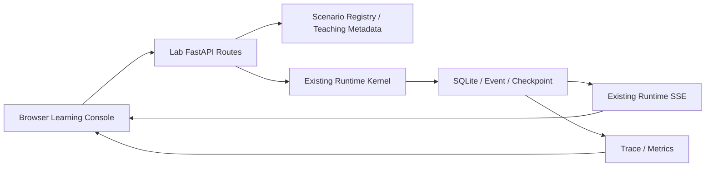

# Agent Runtime Learning Console 使用指南

Learning Console v0.7.12 是本地可视化学习入口。它把单 Run、v0.6 Parent/Child 多 Agent，以及 v0.7 Session、Memory、Context 和 Artifact 的真实执行事实放到同一个浏览器页面中。

> 关键原则：页面不是预制动画。每个场景都会通过真实 `Runtime` 执行，页面读取 SQLite 中的持久化事实，并使用已有 SSE Event Stream 感知新事件。v0.7.12 的 SQLite Inspector 还展示确定性失败根因，顶部“诊断包”入口可以下载脱敏支持 ZIP。

## 1. 一条命令启动

```powershell
cd D:\AICoding\Agent
.\.venv\Scripts\Activate.ps1
python -m pip install -e .[api]
agent-runtime lab
```

CLI 默认启动：

```text
http://127.0.0.1:8000/lab
```

并自动使用系统浏览器打开。只启动服务、不自动打开浏览器：

```powershell
agent-runtime lab --no-browser
```

修改监听地址或端口：

```powershell
agent-runtime lab --host 127.0.0.1 --port 8010
```

也可以继续使用 Uvicorn：

```powershell
uvicorn agent_runtime.api.app:app --reload
```

默认 Demo App 已挂载 `/lab`。

## 2. 页面分区

### 左侧：Learning Path

选择确定性学习场景。v0.7.7 提供以下 9 个真实 Runtime 场景：

1. 纯文本响应。
2. Tool Calling。
3. Token Streaming。
4. Human Approval。
5. v0.6 多 Agent 串行协作。
6. v0.6 多 Agent 并行协作。
7. v0.7 Session 与作用域记忆。
8. v0.7 Context Compaction。
9. v0.7 大 Tool Result Artifact 化。
每张卡片都包含默认输入、学习目标、预期事件路径和自动验收规则。

### 中间：Durable Event Log

尚未启动 Run 时，中间区域只显示一条紧凑的引导提示，用于说明事件来自 SQLite 和 SSE。一旦 Snapshot 中存在事件，该空状态会完全隐藏，不占用泳道图上方空间。

聚合 Snapshot 按 `timeline_sequence` 从左向右展示事件，同时保留每个 Run 自己的 `local_sequence`。纵向位置表示执行主体或领域；多 Agent 场景会动态生成一条 Workflow Parent 泳道和 N 条 Child Agent 泳道：

| 泳道 | 领域 | 典型事件 |
| --- | --- | --- |
| Workflow Parent / Run | Root 或 Workflow 生命周期与委派 | `run.*`、`workflow.*`、`delegation.*` |
| Child Agent × N | 每个 Child Run 的完整内部链路 | Child 自己的 `run.*`、`context.*`、`model.*`、`tool.*`、`checkpoint.*` |
| Session / Memory | 非 Child 的会话与作用域记忆 | `session.run.attached`、`memory.search.*` |
| Context | 非 Child 的模型输入构建与压缩 | `context.built`、`context.compacted` |
| Model | 非 Child 的模型请求与流式输出 | `model.requested`、`model.delta`、`model.completed` |
| Tool | 非 Child 的工具执行与大结果 | `tool.*`、`tool.result.artifactized` |
| Approval | 非 Child 的人工审批 | `approval.requested`、`approval.resolved` |
| State | 非 Child 的 Step / Checkpoint | `checkpoint.created`、`step.completed` |

Child Agent 泳道按 `workflow_step`（串行）或 `workflow_branch`（并行）排序。串行场景显示 Planner → Worker → Reviewer；并行场景显示 Research、Test、Risk 三条并列分支。没有事件的公共领域泳道不会渲染，避免空行占用空间。
泳道图会同时展示：

- **timeline sequence**：顶部 `#N` 是跨 Root/Child 的教学展示顺序；节点同时保留所属 Run 的 local sequence。
- **相对时间**：`+120ms` 表示该事件距首个事件的时间。
- **Run 内部实线**：只连接同一 Run 中按 `local_sequence` 相邻的事件。
- **Parent 委派虚线**：连接 `delegation.created → Child run.created`，表示分叉。
- **Child 汇聚点线**：连接 `Child run.completed/failed/cancelled → delegation.completed/failed/cancelled`，表示结果返回 Parent。
- **并行语义安全**：不同 Child Run 不会因为全局时间上相邻而被直接连线，因此不会把 Research、Test、Risk 误画成串行依赖。
- **实时追加**：Root SSE 触发主更新，运行期间的 Snapshot 轮询补充 Child Run 独立事件。
- **节点联动**：点击任意节点，右侧 Inspector 会显示解释、状态 diff、源码和 payload。

可以使用：

- **从头回放**：把已持久化的事件从 sequence 1 重新放入各泳道。
- **上一步 / 下一步**：逐节点学习，画布会自动将当前节点滚动到可见区域。
- **自动播放**：按慢速、正常或快速播放连线与节点。
- **横向滚动**：事件较多时可拖动底部滚动条，左侧泳道标签始终保持可见。

回放只控制泳道节点和连线的展示游标，不会暂停或篡改 Runtime Kernel；因此不会影响真实执行、状态机和恢复语义。

### 右侧：Runtime Inspector

| Tab | 可以看到什么 |
| --- | --- |
| 事件 | 发生了什么、为什么、下一步、状态 diff、源码方法和 payload |
| 状态 | AgentRun、trace_id、状态、结果、metadata 和回放投影 |
| 消息 | 最近 Checkpoint 中的 system/user/assistant/tool messages |
| 执行 | 持久化 Step、ToolExecution、参数、结果、幂等键和审批标记 |
| Trace | 可折叠 Parent/Child Topology、Root Span 和 v0.6/v0.7 Metrics |
| Context | token budget、原始/选择 token、遗漏消息、Summary 和 Memory IDs |
| Memory | Session、Session Runs、Session/Agent Scope Memory 与 provenance |
| Artifact | 大工具结果文件、字符数、Preview 和 ToolExecution 来源 |
| SQLite | 数据库路径、schema version 和本次 Run 的记录数量 |
| 验收 | 预期事件顺序、状态、Step、工具次数和最终结果检查 |

## 3. 推荐学习顺序

### 场景一：纯文本响应

重点观察：

```text
run.created
→ run.started
→ checkpoint.created
→ context.built
→ model.requested
→ model.completed
→ run.completed
```

理解：一次 Run 不等于一次模型请求；Runtime 负责状态、事件和最终结果收敛。

### 场景二：Tool Calling

默认输入：

```text
19 * 23
```

重点观察：

```text
context.built
→ 第一次 model.requested
→ 模型产生 ToolCall
→ ToolExecution 持久化
→ tool.requested
→ tool.started
→ tool.completed
→ tool message 写入 Checkpoint
→ 第二次 model.requested
→ run.completed
```

在“执行”Tab 中查看：

- 工具参数。
- `idempotency_key`。
- ToolExecution 状态。
- 工具结果。

### 场景三：Token Streaming

重点观察连续的：

```text
model.stream.started
→ model.delta
→ model.delta
→ ...
→ model.stream.completed
```

理解：浏览器看到的增量不是 Provider 直接推送的第二套协议，而是 Runtime Event Log 中的持久化事件。流结束后，Runtime 仍然合并完整 `ModelResponse`、assistant message 和 Checkpoint。

### 场景四：Human Approval

运行后会停在：

```text
waiting_for_approval
```

此时工具尚未执行。右侧会出现“批准并继续”和“拒绝”按钮。

批准路径：

```text
approval.requested
→ 手动批准
→ approval.resolved
→ run.resumed
→ tool.started
→ tool.completed
→ run.completed
```

拒绝路径会把拒绝结果作为 tool message 返回模型，完整保留审批结论和事件。

### 场景五：多 Agent 串行协作（v0.6）

重点观察 `workflow.started → delegation.created → Child Run → delegation.completed` 重复三次，最后 `workflow.completed`。在 Trace Tab 中查看 Planner、Worker、Reviewer 三个 Child 如何组成 Parent/Child Tree。

### 场景六：多 Agent 并行协作（v0.6）

Research、Test、Risk 三个 Child 由独立 asyncio Task 执行。它们拥有独立 Run ID、Event sequence 和 Checkpoint，但共享 Root Trace。最终 Parent 使用 `AggregationStrategy.ALL` 汇聚 JSON 结果。

### 场景七：Session 与作用域记忆（v0.7）

场景会创建一个 Session、一条 Session Memory 和一条 Agent Memory。重点观察 `session.run.attached`、`memory.search.started/completed` 和 `context.built`，再到 Memory Tab 确认 Scope、内容和命中 ID。

### 场景八：Context Compaction（v0.7）

场景通过四轮大工具结果制造长 Checkpoint，并用较小 token budget 触发 `context.compacted`。Context Tab 会显示 original、estimated、omitted、Summary；Messages Tab 仍展示完整 Checkpoint，帮助理解“持久化历史”和“本次模型可见上下文”的区别。

### 场景九：大 Tool Result Artifact（v0.7）

工具返回超过阈值的大文本。完整结果进入 Artifact Store，Tool Message 只保存路径和 Preview。Artifact Tab 可以检查文件存在性、字符数、ToolExecution ID 和内容预览。
## 4. 如何把页面映射回代码

事件检查器会给出源码方法链。例如 `tool.completed`：

```text
Runtime._invoke_tool()
→ ToolRegistry.invoke()
→ SQLiteStore.save_tool_execution_with_event()
→ Checkpoint / RuntimeEvent
```

建议采用以下学习方式：

1. 在页面中运行场景。
2. 从 sequence 1 开始逐步回放。
3. 阅读事件解释和状态 diff。
4. 打开提示的 Python 方法。
5. 对照“消息”“执行”“SQLite”Tab 查看方法产生的持久化结果。
6. 最后查看“Trace”和“验收”，确认整条链路已经收敛。

## 5. Learning Console 架构边界



教学 UI 和解释数据只存在于 `agent_runtime.lab` Adapter。Runtime Kernel 不知道页面、回放按钮、颜色或教学文案。

## 6. 当前限制

- 跨 Run `timeline_sequence` 是 Learning Console 展示序号，不替代 SQLite 中每个 Run 的本地 Event sequence。
- Child Run 独立 Event 不会全部进入 Root SSE，因此页面使用 450ms Snapshot 轮询补充动态展示。
- “逐步回放”是对已持久化事件的展示控制，不是单步暂停 Python 协程。
- Learning Console 面向本地单用户学习，没有身份认证和多租户隔离。
- 页面使用 Vanilla JavaScript，无前端构建工具；复杂 Workflow Designer 不在当前范围。
- 场景使用确定性 Mock Provider，验证的是 Runtime 语义，不代表真实模型回答质量。
## 7. 自动验证

```powershell
cd D:\AICoding\Agent
python -m pytest -p no:cacheprovider -q
python scripts/check_docs.py
```

Learning Console 测试覆盖：9 个场景目录、真实 Runtime、Approval、串行/并行 Parent/Child、TraceTree、Session/Memory 检索、Context Compaction、Artifact 文件、聚合 Snapshot、SQLite 统计和自动验收；当前全量测试为 `55 passed`，并验证串行/并行 Child metadata 可稳定生成独立泳道顺序。

## 可靠性状态怎么读
从 v0.7.10 起，`SQLite` Inspector 会显示 Backup format 与 `offline only` 恢复边界，并给出 `python scripts/run_backup_recovery.py` 演练命令。备份恢复属于 Runtime 外部运维流程，不会伪装成新的 Agent 场景或 Event。

从 v0.7.9 起，“SQLite”Inspector 还展示当前数据库中的 AgentDefinition 快照数量；恢复测试可对照 Run metadata 中的 checksum 理解历史定义绑定。

从 v0.7.8 起，“SQLite”Inspector 额外展示活动任务数、顶层 Run 容量和模型请求并发上限。

从 v0.7.7 起，“SQLite”Inspector 同时显示 Runtime 是否接受请求、SQLite 健康、journal mode、Run health 和 `UNKNOWN Tool` 数量：

- `failed` 是已确认失败；`cancelled` 是明确取消，但不表示副作用已回滚。
- `UNKNOWN` 表示副作用 Tool 已开始但结果无法确认，必须人工核对后再恢复。
- SSE 断线后仍按 SQLite event sequence 恢复，不维护第二份页面状态。
- shutdown 会拒绝新工作并排空任务，无法确认的工作保存为 PAUSED/UNKNOWN，而不是误报 completed。

这些信息不增加业务场景，而是帮助理解成功、失败、取消、审批和结果不确定的差异。

## v0.7.7：如何学习崩溃恢复和 Doctor

Learning Console 的 SQLite Inspector 会显示 `Doctor`、`Diagnostics`、PID、线程、asyncio Task、p95、Provider failure/retry 和 UNKNOWN 数量。它只展示持久化事实，不会替你自动修复。建议同时在终端运行：

```powershell
agent-runtime doctor --json
python scripts/run_crash_recovery.py
```

观察重点：进程崩溃后 Run 不会被误标记成功；副作用 Tool 进入 UNKNOWN 后必须确认结果；确认动作会产生 `tool.outcome_confirmed`，Run 保持 PAUSED，只有显式 `resume()` 才继续。
