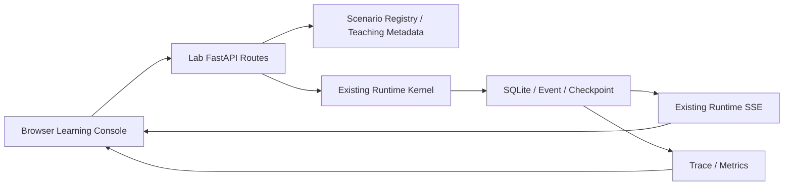

# Agent Runtime Learning Console 使用指南

Learning Console 是 v0.5.3 提供的本地可视化学习入口。它把原本需要多条 PowerShell 命令才能观察的 Run、Event、Step、ToolExecution、Checkpoint、Approval、Trace 和 Metrics 放到同一个浏览器页面中。

> 关键原则：页面不是预制动画。每个场景都会通过真实 `Runtime` 执行，页面读取 SQLite 中的持久化事实，并使用已有 SSE Event Stream 感知新事件。

## 1. 一条命令启动

```powershell
cd D:\AICoding\Agent
.\.venv\Scripts\Activate.ps1
python -m pip install -e .[api]
agent-runtime lab
```

CLI 默认启动：

```text
http://127.0.0.1:8000/lab
```

并自动使用系统浏览器打开。只启动服务、不自动打开浏览器：

```powershell
agent-runtime lab --no-browser
```

修改监听地址或端口：

```powershell
agent-runtime lab --host 127.0.0.1 --port 8010
```

也可以继续使用 Uvicorn：

```powershell
uvicorn agent_runtime.api.app:app --reload
```

默认 Demo App 已挂载 `/lab`。

## 2. 页面分区

### 左侧：Learning Path

选择确定性学习场景。v0.5.3 继续提供以下 4 个场景：

1. 纯文本响应。
2. Tool Calling。
3. Token Streaming。
4. Human Approval。

每张卡片都包含默认输入、学习目标、预期事件路径和自动验收规则。

### 中间：Durable Event Log

尚未启动 Run 时，中间区域只显示一条紧凑的引导提示，用于说明事件来自 SQLite 和 SSE。一旦 Snapshot 中存在事件，该空状态会完全隐藏，不占用泳道图上方空间。

持久化事件按 `RuntimeEvent.sequence` 从左向右进入动态泳道。纵向位置表示执行角色，曲线表示相邻事件之间的先后关系：

| 泳道 | 领域 | 典型事件 |
| --- | --- | --- |
| Run | Run 生命周期 | `run.created`、`run.started`、`run.completed` |
| Model | 模型请求与流式输出 | `model.requested`、`model.delta`、`model.completed` |
| Tool | 工具执行 | `tool.requested`、`tool.started`、`tool.completed` |
| Approval | 人工审批 | `approval.requested`、`approval.resolved` |
| State | Step / Checkpoint | `checkpoint.created`、`step.completed` |

泳道图会同时展示：

- **sequence**：每个节点顶部的 `#N` 是持久化顺序。
- **相对时间**：`+120ms` 表示该事件距首个事件的时间。
- **执行跳转**：连线从上一个事件指向下一个事件，可直观看到 Run 如何转入 Model、Tool、Approval 或 State。
- **实时追加**：SSE 收到新事件时，新节点追加到右侧并自动跟随。
- **节点联动**：点击任意节点，右侧 Inspector 会显示解释、状态 diff、源码和 payload。

可以使用：

- **从头回放**：把已持久化的事件从 sequence 1 重新放入各泳道。
- **上一步 / 下一步**：逐节点学习，画布会自动将当前节点滚动到可见区域。
- **自动播放**：按慢速、正常或快速播放连线与节点。
- **横向滚动**：事件较多时可拖动底部滚动条，左侧泳道标签始终保持可见。

回放只控制泳道节点和连线的展示游标，不会暂停或篡改 Runtime Kernel；因此不会影响真实执行、状态机和恢复语义。

### 右侧：Runtime Inspector

| Tab | 可以看到什么 |
| --- | --- |
| 事件 | 发生了什么、为什么、下一步、状态 diff、源码方法和 payload |
| 状态 | AgentRun、trace_id、状态、结果、metadata 和回放投影 |
| 消息 | 最近 Checkpoint 中的 system/user/assistant/tool messages |
| 执行 | 持久化 Step、ToolExecution、参数、结果、幂等键和审批标记 |
| Trace | Run/Model/Tool/Approval Span 和全局 Metrics 摘要 |
| SQLite | 数据库路径、schema version 和本次 Run 的记录数量 |
| 验收 | 预期事件顺序、状态、Step、工具次数和最终结果检查 |

## 3. 推荐学习顺序

### 场景一：纯文本响应

重点观察：

```text
run.created
→ run.started
→ checkpoint.created
→ model.requested
→ model.completed
→ run.completed
```

理解：一次 Run 不等于一次模型请求；Runtime 负责状态、事件和最终结果收敛。

### 场景二：Tool Calling

默认输入：

```text
19 * 23
```

重点观察：

```text
第一次 model.requested
→ 模型产生 ToolCall
→ ToolExecution 持久化
→ tool.requested
→ tool.started
→ tool.completed
→ tool message 写入 Checkpoint
→ 第二次 model.requested
→ run.completed
```

在“执行”Tab 中查看：

- 工具参数。
- `idempotency_key`。
- ToolExecution 状态。
- 工具结果。

### 场景三：Token Streaming

重点观察连续的：

```text
model.stream.started
→ model.delta
→ model.delta
→ ...
→ model.stream.completed
```

理解：浏览器看到的增量不是 Provider 直接推送的第二套协议，而是 Runtime Event Log 中的持久化事件。流结束后，Runtime 仍然合并完整 `ModelResponse`、assistant message 和 Checkpoint。

### 场景四：Human Approval

运行后会停在：

```text
waiting_for_approval
```

此时工具尚未执行。右侧会出现“批准并继续”和“拒绝”按钮。

批准路径：

```text
approval.requested
→ 手动批准
→ approval.resolved
→ run.resumed
→ tool.started
→ tool.completed
→ run.completed
```

拒绝路径会把拒绝结果作为 tool message 返回模型，完整保留审批结论和事件。

## 4. 如何把页面映射回代码

事件检查器会给出源码方法链。例如 `tool.completed`：

```text
Runtime._invoke_tool()
→ ToolRegistry.invoke()
→ SQLiteStore.save_tool_execution_with_event()
→ Checkpoint / RuntimeEvent
```

建议采用以下学习方式：

1. 在页面中运行场景。
2. 从 sequence 1 开始逐步回放。
3. 阅读事件解释和状态 diff。
4. 打开提示的 Python 方法。
5. 对照“消息”“执行”“SQLite”Tab 查看方法产生的持久化结果。
6. 最后查看“Trace”和“验收”，确认整条链路已经收敛。

## 5. Learning Console 架构边界



教学 UI 和解释数据只存在于 `agent_runtime.lab` Adapter。Runtime Kernel 不知道页面、回放按钮、颜色或教学文案。

## 6. 当前限制

- v0.5.3 只提供 4 个确定性场景。
- “逐步回放”是对已持久化事件的展示控制，不是单步暂停 Python 协程。
- Learning Console 面向本地单用户学习，没有身份认证和多租户隔离。
- 页面使用 Vanilla JavaScript，无前端构建工具；复杂 Workflow Designer 不在当前范围。
- 目前不展示跨 Run 的 Parent/Child Trace Tree；这将在 v0.6 多 Agent 后补充。

## 7. 自动验证

```powershell
cd D:\AICoding\Agent
python -m pytest -p no:cacheprovider -q
python scripts/check_docs.py
```

Learning Console 测试覆盖：静态页面、场景目录、真实 Runtime 执行、Tool Calling、Token Streaming、Approval 暂停/恢复、Snapshot、Trace、SQLite 统计和自动验收。
